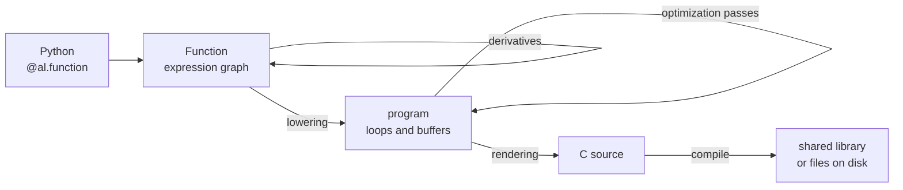

# Getting started

This page builds one small optimal-control problem from nothing to compiled C: a model of a
point mass, a cost over a horizon, the derivatives an optimizer needs, a solve, and finally the C
source you would integrate into your own code. 
It is about forty lines of Python in total, and each section adds to the previous one, so it reads top to bottom.

Along the way it introduces the four ideas the rest of the guide assumes: **expressions**,
**functions**, **compilation**, and **derivatives as functions**. Details live in the pages linked
from each section.

You will need alloy installed ([Installation](installation.md)) and a C compiler on your path. The
solve near the end also needs the vendored IPOPT built; everything before it does not.

## Expressions

Start with a symbol:

```python
import numpy as np
import alloy as al

z = al.sym("z", 2)      # state: position and velocity
u = al.sym("u", 1)      # control: acceleration
```

`z` and `u` are not arrays. They are `Expr` — a node in an expression graph — and every operation on it
records another node instead of computing a number:

```python
zdot = al.concat([z[1:], u])       # [velocity, acceleration]
znext = z + 0.1 * zdot             # one explicit Euler step, dt = 0.1
```

Nothing has been evaluated. `znext` is a graph, and you can look at it:

```python
print(znext.debug())
```

```text
%0 = input z : float64(2,)
%1 = const 0.1 : float64()
%2 = slice(%0) : float64(1,)
%3 = input u : float64(1,)
%4 = concat(%2, %3) : float64(2,)
%5 = mul(%1, %4) : float64(2,)
%6 = add(%0, %5) : float64(2,)
outputs %6
```

Two things about this graph are worth noticing now, because everything downstream depends on them.
Every node carries a **static type**: a shape and a dtype, fixed when the node is built. There are
no symbolic dimensions — a horizon of 20 and a horizon of 40 are two different graphs. 
Arithmetic follows NumPy's broadcasting rules, so `0.1 * zdot` means what you expect, while mixed
dtypes raise instead of quietly widening.

You can find the full set of supported operations [here](../how_it_works/expr_ir.md#operations).

## Functions

An expression on its own has no name and no boundary. A `Function` gives it both: named inputs,
named outputs, and the graph between them. It is the unit of composition, of differentiation, and of
compilation — nearly everything in alloy either builds one or transforms one.

The decorator is the usual way to build one. Declare the input shapes, write the body with ordinary
Python, and return a dictionary naming the outputs:

```python
@al.function("step", {"z": 2, "u": 1})
def step(z, u):
    return {"znext": z + 0.1 * al.concat([z[1:], u])}
```

The decorator hands your body fresh symbolic inputs of the declared shapes, runs it **once**, and
keeps the graph that came out. The body is not a function that will be called later with numbers; it
is a recipe that ran at definition time to produce a graph.

Now call it with numbers:

```python
step([1.0, 2.0], [0.5])     # array([1.2 , 2.05])
```

Inputs go positionally in declared order, or by keyword — not both at once. One output comes back as
the array itself, several outputs as a tuple.
Both inputs and outputs are expected to be NumPy arrays with the declared shapes and dtypes, but inputs
are converted to NumPy arrays if they are not already.

## The first call is a compilation

That one call did quite a lot under the hood. Alloy lowered the expression graph into a second representation with
explicit loops, buffers and memory, ran optimization passes over it, rendered a C file,
compiled it, cached the shared library on disk, loaded it back, executed it and wrapped the result in a NumPy array. The second call skips all of that, whether you run it in the same script or a later process, since
the cache is keyed on the generated source text and lives on disk.



This is the part of the mental model that pays off later: **there is no interpreter behind alloy.**
No Python evaluator, and no second implementation that could disagree with the generated code. The
numbers you just got back are the numbers the generated C produces, because they *are* the generated
C. Compiling on demand from Python and writing C files for a C++ application are the same lowering,
the same passes and the same renderer — only the last step differs.

Those two last steps are the two ways to use alloy, and the docs name them the usual way. Compiling
on demand when a function is first called, then caching the result, is the just-in-time path (JIT).
Rendering the C to files for someone else to build and link is the ahead-of-time path (AOT). The
`JitError` and `JitUnavailable` exceptions below come from the first one, as does the `jit` in the
cache directory's name; [Code generation](codegen.md) is the guide to both.

Two consequences:

- Alloy fails loudly instead of falling back: no compiler means an exception, not a slow path.
- Building a large graph in Python costs real seconds, once, while the code that runs afterwards has no Python in it at all.

For more details, see [Architecture](../how_it_works/architecture.md) to understand the full pipeline and [Code generation](codegen.md) to understand the caching.

## Composing

Functions call each other, and the call survives as a call:

```python
N = 20

@al.function("rollout", {"z0": 2, "us": N})
def rollout(z0, us):
    z, cost = z0, 0.0
    for k in range(N):
        u = us[k : k + 1]
        cost = cost + al.sumsqr(z) + 0.1 * al.sumsqr(u)
        z = step.call([z, u])[0]
    return {"zN": z, "J": cost + 10.0 * al.sumsqr(z)}
```

This is single shooting: given an initial state and a whole sequence of controls, roll the model
forward, accumulate a quadratic cost, and report where you ended up and what it cost.

```python
rollout([1.0, 0.0], np.zeros(N))    # (array([1., 0.]), array(30.))
```

Note that we used `step.call()` instead of `step`. 
The first (`Function.__call__`) triggers the compilation pipeline to evaluate the function numerically, the second (`Function.call`) evaluates its body symbolically and returns one `Expr` per callee output.
This always returns a tuple, which is why we had to index `[0]` for `znext`.
The Python `for` loop runs at graph-construction time, which is why `N` has to be a number.

The call is not inlined: `step` appears **once** in the generated C, and `rollout` calls it. Its
derivative behaves the same way — one derivative of `step`, called repeatedly, rather than twenty
copies of it. That is the first half of keeping generated code small.

It is only half, because the loop itself was unrolled. The `for` loop ran in Python, so `rollout`
holds twenty separate call nodes and the generated C has twenty call sites in it. The body of `step`
does not get duplicated, but the caller still grows with the horizon — 7.9 KB of C at twenty stages,
14.2 KB at forty, 20.7 KB at sixty.

Linear growth in the number of stages beats linear growth in stages × model size, which is what
inlining would give you, but it is still growth. It also has a ceiling: at a hundred stages the
chain of stages and the accumulated cost are deep enough that lowering exhausts Python's recursion
limit
([why, and how to write around it](../how_it_works/lowering.md#a-limitation-worth-knowing-recursion-depth)).

The fix is to stop unrolling, and it needs the problem written slightly differently. We come back to
it in [Keeping the loop a loop](#keeping-the-loop-a-loop) once there is a solve to compare against.

## Derivatives

An optimizer needs the gradient of that cost. Ask for it:

```python
grad = al.gradient(rollout, "J", "us", extra_inputs=["z0"])
grad.input_names                                  # ('us', 'z0')
grad(np.zeros(N), np.array([1.0, 0.0]))[:4]       # array([7.22, 6.66, 6.12, 5.6 ])
```

`grad` is another `Function` — the same kind of object, with the same treatment. It compiles on
first call, it can be composed into a larger graph, and it can be written out as C. There is no tape
and no separate derivative runtime: differentiation is a graph-to-graph transformation, and its
result is an ordinary graph. `extra_inputs=["z0"]` carries the parameter through, so the derivative
takes the same data the original did.

The named wrappers cover the common requests:

```python
al.gradient(fn, "f", "x")     # gradient for a scalar f
al.jacobian(fn, "y", "x")     # dense Jacobian
al.hessian(fn, "f", "x")      # second derivatives
al.sparse_jacobian(fn, "y", "x")   # only the nonzeros, plus the pattern
al.sparse_hessian(fn, "f", "x")    # likewise for the Hessian
```

Each is convenience over one mechanism — a **request** passed to `Function.factory` — and going to
the factory directly is what you want when one artifact should produce several results:

```python
oracle = rollout.factory(
    "rollout_all",
    ["z0", "us"],
    ["J", al.factory.Grad("J", "us"), al.factory.SpJac("zN", "us")],
)
oracle.output_names     # ('J', 'grad_J_us', 'spjac_zN_us')
```

One function, three outputs, one shared library, and the subexpressions shared between the cost and
its derivatives computed once instead of three times. `al.factory.Grad("J", "us")` is a typed object rather
than a string, so there is no grammar to mis-spell; a name that does not exist is caught by
`factory`, naming the request, long before anything is evaluated.

`al.sparse_jacobian` asks for the *sparse* Jacobian: alloy works out symbolically where the nonzeros can be,
colors the pattern, and generates code that computes only those — and the pattern travels with the
result and into the generated header. A constraint Jacobian over a horizon is mostly zeros with
structure, which is where most of the win in a real problem comes from.

More in [Derivatives](derivatives.md) and [Sparsity](sparsity.md).

## Solving

Everything so far has been a model. To turn it into an optimization problem, name the decision
variable and the parameter, take the expressions out of `rollout`, and hand them to a solver
builder:

```python
us = al.sym("us", N)
z0 = al.sym("z0", 2)
zN, J = rollout.call([z0, us])

solver = al.nlp(
    x=us,                      # decision variable
    p=z0,                      # parameter: the current state
    f=J,                       # minimize the rollout cost
    h_eq=zN,                   # subject to arriving at the origin
    x_lb=np.full(N, -2.0),     # bounded control authority
    x_ub=np.full(N, 2.0),
    solver="ipopt",
    options={"print_level": 0},
)
```

`al.nlp` builds the oracles it needs — objective gradient, sparse constraint Jacobian, sparse
Lagrangian Hessian — through the same `factory` you just used, and wraps IPOPT around them. What
comes back is again a `Function`:

```python
solver.input_names     # ('x0', 'lam_eq0', 'lam_ineq0', 'lam_box0', 'z0')
solver.output_names    # ('x', 'f', 'h_eq', 'g_ineq', 'lam_eq', 'lam_ineq', 'lam_box')

out = solver(
    x0=np.zeros(N),
    lam_eq0=np.zeros(2),
    lam_ineq0=np.zeros(0),
    lam_box0=np.zeros(N),
    z0=np.array([1.0, 0.0]),
)
out["x"][:4]           # array([-2., -2., -1.5637, -0.9468])
out["f"]               # 15.2469
solver.last_status     # SolverStatus(code=0, name='OK', iter=8, ...)
```

The first four controls saturate the bound, which is what you would hope for from a mass that has
to stop at the origin. A solver takes initial guesses first — primal, then one set of multipliers
per constraint category — and then every free parameter it found in your expressions, in name
order. Read that order off `input_names` rather than guessing it. Solves return a dict rather than a
tuple, because positional indexing into seven outputs is a bug waiting to happen.

The supported problem formulations and conventions can be found in [Solvers](solvers.md), and the currently supported solvers are listed in [Solver backends](solver_backends.md).

Because `solver` is a real `Function`, it can go **inside** another graph: `solver.call([...])`
returns ordinary expressions, so a model can contain a solve, and the whole thing — oracles, solver
wrapper, host entry point — compiles into one shared library with nothing interpreted in the loop.
See [this section](solvers.md#nesting-a-solver-in-a-graph) for more details.


## Keeping the loop a loop

Back to the loop. `al.vmap` is the way to say "the same callee, applied to a different input
each time" — one node instead of twenty calls, which stays a real loop through lowering *and*
through differentiation. But it can only do that if every iteration is independent, and in the
rollout above iteration `k` needs the state that iteration `k-1` produced.

So we change the formulation: instead of computing the states from the controls, we make the states
decision variables too, and ask the solver to enforce the dynamics as constraints. This is multiple
shooting. The stage relation becomes a *defect*, which is a function of one stage's variables only:

```python
@al.function("defect", {"z": 2, "u": 1, "znext": 2})
def defect(z, u, znext):
    return {"d": step.call([z, u])[0] - znext}
```

Now the whole horizon is one node. Lay the decision variable out as all the states followed by all
the controls, and give `vmap` a slice rule per callee input:

```python
NW = 2 * (N + 1) + N
w = al.sym("w", NW)                  # [z_0 ... z_N, u_0 ... u_{N-1}]
z_init = al.sym("z_init", 2)
zs, us = w[: 2 * (N + 1)], w[2 * (N + 1) :]

defects = al.vmap(defect, N, {"z": (zs, 0, 2), "znext": (zs, 2, 2), "u": (us, 0, 1)})
defects.shape                        # (40,) — two defect equations per stage
```

Each rule is `(outer, start, stride)`: iteration `i` reads `outer[start + i*stride :]` for as many
elements as that formal needs. So `z` walks `zs` two at a time from the beginning, `znext` walks the
same tensor two at a time starting one state later, and `u` walks the controls one at a time. The
overlap between `z` and `znext` is what chains the stages together, without any Python loop.

The rest is ordinary expression building — no loop, so nothing to unroll:

```python
J = al.sumsqr(zs) + 0.1 * al.sumsqr(us) + 9.0 * al.sumsqr(zs[2 * N :])
h_eq = al.concat([defects, zs[0:2] - z_init, zs[2 * N :]])

solver = al.nlp(
    x=w,
    p=z_init,
    f=J,
    h_eq=h_eq,                       # dynamics, initial state, terminal state
    x_lb=np.concatenate([np.full(2 * (N + 1), -np.inf), np.full(N, -2.0)]),
    x_ub=np.concatenate([np.full(2 * (N + 1), np.inf), np.full(N, 2.0)]),
    solver="ipopt",
    options={"print_level": 0},
)

out = solver(
    x0=np.zeros(NW),
    lam_eq0=np.zeros(2 * N + 4),
    lam_ineq0=np.zeros(0),
    lam_box0=np.zeros(NW),
    z_init=np.array([1.0, 0.0]),
)
out["x"][2 * (N + 1) :][:4]          # array([-2., -2., -1.5637, -0.9468])
out["f"]                             # 15.2469
```

The same optimum, in the same eight iterations — it is the same problem, written so that the
repetition is visible to the compiler instead of being spent in Python. What changed is how it
scales:

| Horizon | unrolled `rollout` | `vmap` defects |
| --- | --- | --- |
| 20 | 7.9 KB | 2.1 KB |
| 40 | 14.2 KB | 2.1 KB |
| 60 | 20.7 KB | 2.1 KB |
| 100 | `RecursionError` | 2.2 KB |

Flat, and it stays flat at five hundred stages. The sparsity comes out of the same node: the
constraint Jacobian at `N = 20` is 40 × 62 with 120 nonzeros, and alloy finds that structure by
coloring `defect`'s own small pattern once rather than the whole banded matrix — which is what keeps
the derivative cheap as well as the source small.

This is the single most important habit for long horizons. [Building
functions](functions.md#regular-repetition-vmap) has the full `vmap` rules, [Sparsity](sparsity.md)
the coloring, and [the scalability sweep](../results/scalability.md) the measurements against CasADi.

## Shipping it

Nothing so far has left Python, but the artifact was always C. Ask for it — this is the
ahead-of-time path:

```python
from alloy.codegen import render_c_module

module = render_c_module(rollout)
print(module.header)     # the .h
print(module.source)     # the .c
```

Or write both files from a shell:

```bash
uv run python -m alloy.codegen mymodule:rollout -o generated/
```

This is the same pipeline the first call ran — compiling in place and writing files differ only in
the last step, which is why what you tested from Python is what you deploy. The result depends on
nothing but `libm`: not on alloy, not on Python. Every generated function is reachable through one
signature,

```c
int rollout(const double** arg, double** res, int* iw, double* w, void* mem);
```

with the buffer sizes, the sparsity patterns and optional typed C++ wrappers declared in the header
next to it. A shared convention is what lets generated functions call each other, a generated solver
drive generated oracles, and an existing C++ consumer take a new function without learning anything.

See [Code generation](codegen.md) and [the C ABI](../how_it_works/c_abi.md).

## An aside for CasADi users

If this felt familiar, that is deliberate. `Function` as the unit of everything, derivatives asked
for through a factory, sparsity carried as structural metadata, and one universal C signature per
generated function are all CasADi's ideas, kept because they are the right ones.

Three differences are worth knowing up front:

- **Derivative requests are typed objects, not strings.** `al.factory.Grad("J", "us")` instead of
  `"grad:J:us"`. Same expressiveness, less grammar.
- **There is no SX-or-MX choice.** Alloy has one `Expr` type, and one lowering that mixes unrolled
  scalar code with loops over blocks, instead of two graph types you pick between for a whole
  codebase up front.
- **It is pure Python**, with NumPy and an internal SciPy sparse-analysis dependency. Reading and editing the
  compiler needs no build step; the cost is paid when building large graphs, not when running them.

[Alloy next to its neighbours](../how_it_works/comparison.md) goes into more detail on this comparison with CasADi and other libraries that have shaped alloy's development.

## When something goes wrong

Alloy fails loudly rather than falling back, so the exception type tells you which stage gave up.

| Exception | What it means | Where to look |
| --- | --- | --- |
| `VerifyError` | a graph broke a dialect rule. The message names the node, its op and the rule. | [the expression dialect](../how_it_works/expr_ir.md#verification) |
| `LoweringError` | the graph is valid but uses an operation the lowerer does not cover yet. Rendering C raises it directly; a JIT call reports `JitUnavailable` with this as its cause. | [Lowering](../how_it_works/lowering.md#the-rule-registry) |
| `JitUnavailable` | no usable C compiler was found, or the function cannot be lowered. | `uv run python -m alloy.codegen.toolchain` |
| `JitError` | the compiler ran and returned an error, or the function is placed on a non-host device. The message carries the compiler's output. | usually a bad solver option baked into a generated wrapper |
| `SolverLibraryError` | a solve needs a vendored library that was never built. | rerun the sync with `ALLOY_BUILD_SOLVERS=required` |
| `RecursionError` during lowering | an expression is too deeply chained — usually an accumulator written as a left fold. | [the depth limit and how to write around it](../how_it_works/lowering.md#a-limitation-worth-knowing-recursion-depth) |

Stale compiled artifacts are never the cause — the cache is keyed on the generated source text — but
if you want to rule it out, `fn.recompile()` drops one function's entry, and deleting the cache
directory is always safe.

To see what alloy did rather than guess, `al.render_expr_assembly(fn)` prints a stable assembly text
of the graph, and `alloy.viz` records every stage and pass of a compile for a browser view:

```python
from alloy.viz import visualize, serve

visualize(rollout)
rollout([1.0, 0.0], np.zeros(N))
serve()
```

See [Visualization](visualization.md).

## Where to go next

- [Building functions](functions.md) — shapes, composition, `vmap`, lowering hints
- [Derivatives](derivatives.md) — the factory, the spec kinds, seeded modes
- [Sparsity](sparsity.md) — patterns, coloring, compact values
- [Solvers](solvers.md) — `al.qp` and `al.nlp`, and nesting a solve in a graph
- [Code generation](codegen.md) — the JIT cache, ahead-of-time output, and using the result from C
- [How it works](../how_it_works/architecture.md) — if you would rather understand the compiler first
