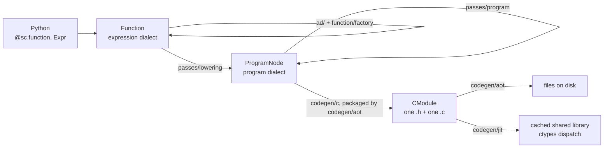

# Scaly architecture

Scaly turns symbolic models written in Python into compiled C. This page is the map of how that
happens: the pieces, the direction they point, and where a change belongs.

"The short version" and "Following one call" describe the whole system at low resolution.
"Package map" and "Import layers" are the reference tables. The rest goes stage by stage. The
semantics of the two dialects and of the C ABI (application binary interface) have their own
pages, linked as they come up.

## The short version

Scaly has two intermediate representations and one direction of travel.

- The expression dialect (`ir/expr.py`) says what to compute: an immutable DAG of `Expr` nodes
  carrying shape, dtype and sparsity, hash-consed so that building the same node twice returns the
  same object. A `Function` names a graph and is the unit of composition, differentiation and
  compilation.
- The program dialect (`ir/program.py`) says how to compute it: `ProgramNode`s that spell out
  loops, buffers, loads, stores, calls and kernel launches.
- `passes/` holds every transformation: expression rewrites, the lowering from one dialect to the
  other, and program-dialect optimizations.
- `codegen/` renders the program dialect to C, then either writes it to disk (the ahead-of-time
  path, AOT) or compiles, caches and dispatches it in-process (the just-in-time path, JIT). There is
  no interpreter. Python calls, tests and generated C all take the same path, and gaps raise.
- Everything else hangs off that spine. `ad/` builds derivative graphs inside the expression
  dialect. `function/` is the user-facing frontend. `solvers/` wraps vendored QP and NLP (quadratic
  and nonlinear programming) backends as opaque `Function`s. `viz/` watches the pipeline without
  being part of it.



## Following one call

```python
import scaly as sc
import numpy as np


@sc.function(sc.L("x", 2), sc.L("f", ...))
def rosenbrock(x: sc.Expr) -> sc.Expr:
  return (1 - x[0]) ** 2 + 100 * (x[1] - x[0] ** 2) ** 2


grad = sc.gradient(rosenbrock, "f", "x")
grad(np.array([1.0, 2.0]))
```

| # | What happens | Where |
| --- | --- | --- |
| 1 | The decorator makes fresh input symbols, runs the body, and wraps the returned exprs in a `Function`. | `function/api.py`, `function/model.py` |
| 2 | `sc.factory.Grad("f", "x")` is a typed request object. `Function.factory` resolves the named input and output and calls the spec's `build`. | `function/model.py` (`factory`), `function/factory.py` (the specs) |
| 3 | `sc.factory.Grad`'s `build` is one reverse sweep over the expression DAG. Other kinds dispatch elsewhere: `sc.factory.Jac` batches forward mode over the identity, and `sc.factory.SpJac` colors a structural pattern first. | `ad/derivatives.py`, `ad/reverse.py` |
| 4 | The result is another `Function`, in the same dialect as the first. Nothing has been compiled yet. | `function/model.py` |
| 5 | Calling it with array leaves runs `__call__`, `numerical_call`, `_flat_numerical_call` and `_compile`, which reaches the backend through `_jit()`. That is the one place in the frontend that imports the backend, and the first of the [two sanctioned exceptions](#the-two-sanctioned-exceptions) to import layering. | `function/model.py` |
| 6 | `CompiledFunction` asks `_build_artifact` for a shared library, which calls `render_c_module`. That lowers the function once into a render context every artifact reads from. | `codegen/jit.py`, `codegen/aot.py` |
| 7 | `lower_function` normalizes a private copy of each ordinary Function's outputs, then walks the expr DAG topologically; each `ExprOp` has one registered rule that emits program-dialect nodes. Callees become separate procedures; a Function carrying a solver descriptor stays opaque. | `passes/lowering.py` |
| 8 | `optimize_program` runs the fixed pipeline: `hoist_invariant`, `scalarize`, `prune_procedures`, `combine_scatter_sums`, `fuse_elementwise`, `fold_arith`, `unroll_unit_loops`, `fold_arith_after_unroll`, `pack_workspace`, `coalesce_stores`, `prepare_scalar`. | `passes/program/` |
| 9 | `verify_program` checks the result before anything renders it. | `ir/program_spec.py` |
| 10 | `render_program_c` emits the translation unit: the callee bodies, then the one entry point exported through the universal ABI, the single pointer-array C signature every generated function shares. | `codegen/c.py` |
| 11 | Header, source, workspace size and solver link flags are packaged as a `CModule`. | `codegen/aot.py` |
| 12 | A SHA-256 over (cache version, ABI signature, function name, source text, compile flags) keys the artifact. On a miss, `cc` builds a shared library; then `dlopen` and a ctypes call through that ABI. The library is cached under `$XDG_CACHE_HOME/scaly/jit` (or `SCALY_CACHE_DIR`) and reused by every function with the same key. | `codegen/jit.py` |

AOT stops at step 11 and writes the pair to disk (`scaly_codegen <module>:<attr> -o <dir>`).
Both consumers read the same `CModule`, so the header's `SZ_W`, the source's spill size and the
scratch array a caller has to allocate cannot disagree.

## Package map

One line of ownership per module. Every module states the same thing in its own docstring, at more
length; if the two disagree, the docstring wins. The `__init__.py` files are not listed; each
one's docstring says what its package owns.

```
src/scaly/
  __init__.py            curated public re-exports, and nothing else

  ir/                    dialect definitions, verification, text, pass infrastructure
    types.py             DType, DeviceSpec, TensorType, SparsityType, ScalarType, backend support
    expr.py              ExprOp, OP_INFO, Expr, interning, builders, topo, format_expr
    expr_spec.py         expression-dialect verify rules, verify_expr
    program.py           ProgramOp, RangeKind, ProgramNode, interning, builders
    program_spec.py      program-dialect verify rules, verify_program
    spec.py              the shared Rule/Spec table machinery and the one VerifyError
    match.py             Pattern, PatternMatcher, rewrite: how a pass is defined and applied
    text.py              the stable assembly listings for both dialects, plus format_program

  passes/                every concrete IR-to-IR transformation
    affine.py            the affine structure of a concrete index array, for table-free gathers
    arith.py             shared arithmetic identities (simplify_arith, fold_program)
    expr.py              simplify, constant folding, CSE            (Expr -> Expr)
    lowering.py          lower_function, the per-ExprOp rule registry (Expr -> ProgramNode)
    program/             program optimizations                    (ProgramNode -> ProgramNode)
      __init__.py        explicit PASS_PIPELINE and optimize_program
      _common.py         shared buffer references, loop helpers, names, and reachability
      hoist_invariant.py loop-invariant callee work moved before a mapped loop
      scalarize.py       bounded scalar expansion, folding, and scheduling
      combine_scatter_sums.py  shared accumulation for sums of scatters
      fuse_elementwise.py     elementwise producer fusion
      fold_arith.py           constant reads and shared arithmetic identities in loop bodies
      unroll_unit_loops.py    empty- and single-iteration loop removal
      pack_workspace.py      buffer lifetime packing
      coalesce_stores.py     alias-safe adjacent store pairing
      scheduling.py          shared scalar value scheduling
      prepare_scalar.py      statement-local depth bounds before rendering

  function/              the frontend
    model.py             Function, call composition, graph validation
    tree.py              the typed pytree declarations (Tree, L, G)
    factory.py           the typed derivative specs and the AD each dispatches to
    api.py               the @function decorator and the convenience derivative wrappers
    sugar.py             expression builders that need a Function; today just vmap

  ad/                    derivative construction, all of it inside the expression dialect
    forward.py           jvp, jvp_many
    reverse.py           vjp, vjp_many, and the per-op local adjoint rules
    derivatives.py       jacobian, gradient, hessian, basis, finite_difference
    sparsity.py          structural sparsity patterns and greedy coloring; no AD in it
    sparse.py            sparse_jacobian, sparse_hessian: AD driven by a structural pattern

  codegen/
    abi.py               the universal C ABI: signature, status codes, mangling, typed buffers
    c.py                 ProgramNode -> standalone scalar C; no lowering policy of its own
    __main__.py          compatibility shim for `python -m scaly.codegen`
    solver.py            solver-wrapper framing around a plugin-rendered body
    aot.py               one lowering -> CModule, the file-writing driver, the CLI
    jit.py               CModule -> compile, cache, dlopen, ctypes dispatch
    toolchain.py         C compiler discovery, cache root, the diagnostics report

  solvers/
    model.py             SolverDescriptor and its opaque plain Function
    problem.py           typed backend-free Problem declarations
    solver.py            backend selection
    graph.py             the solver queries over a Function graph
    registry.py          plugin discovery and protocol validation
    paths.py             vendored solver library and header discovery
    stats.py             the versioned solver-statistics ABI and SolverStatus
    qp.py nlp.py         quadratic proof/extraction and NLP oracle construction
    _oracle.py           shared oracle-assembly helpers

  viz/
    graph.py             graph JSON, colors and labels; presentation, not compiler text
    recording.py         records a render by registering into codegen's observer hook
    serve.py             the tiny recording browser

  utils/
    env.py               the environment variables and platform facts scaly reads
    names.py             C identifier spelling shared by passes and code generation
    torch_state_dict.py  reading PyTorch checkpoints without depending on torch
```

Solver backends are not in this tree. Each is a separate distribution under `plugins/`
(`scaly-piqp`, `scaly-ipopt`, `scaly-sqp`) discovered through an entry point; see
[Solver plugins](../dev/solver_plugins.md). `tests/` mirrors this layout directory for directory.

## Import layers

Every module has an import layer. A module may import modules in its own import layer or a lower
one, never a higher one.

| Import layer | Modules | Why here |
| --- | --- | --- |
| 0 | `utils/*` | Leaves. Environment, identifier spelling and file parsing; no scaly concepts. |
| 1 | `ir/*` | The vocabulary. Both dialects, their verifiers, their text, and the machinery for defining passes. |
| 2 | `passes/affine`, `passes/arith`, `passes/expr`, `ad/sparsity`, `solvers/stats` | Above import layer 1 but below the frontend: index-map recovery, shared arithmetic identities, expression rewrites, structural sparsity, and the solver-statistics layout (which needs nothing from the IR). Nothing here knows what a `Function` is. |
| 3 | `function/{model,tree}` | `Function` itself, a named graph boundary over import layer 1, and the pytree declarations. |
| 4 | `ad/{forward,reverse,derivatives,sparse}`, `function/sugar` | Differentiation, which has to look inside a callee, and the one builder that does too (`vmap`). |
| 5 | `function/{factory,api}`, the rest of `solvers/` | The user-facing request layer: typed derivative specs, the decorator, the solver builders. |
| 6 | `passes/lowering`, `passes/program/*` | Lower whole Functions, including their solver callees, and optimize the program dialect. |
| 7 | `codegen/*` | The backend: render, compile, load, dispatch. |
| 8 | `viz/*` | Observes the backend. Nothing in the compiler depends on it. |
| 9 | `scaly/__init__` | The public names sit above everything they re-export. |

`passes/` straddles the frontend: its expression rewrites are below `Function` (import layer 2)
and its lowering is above it (import layer 6). Enforcement is per module, not per package, so
this is legal. Package `__init__` files carry their own entry, set by what they re-export:
`scaly.function` re-exports names from import layer 3 and is import layer 3, while `scaly.passes`
re-exports nothing and sits at import layer 1, below both of its modules.

`tests/test_import_layering.py` holds this table and reads imports with `ast`, function-local ones
included, since a deferred import inside a function is how the old cycles stayed alive. It also
checks that the graph is acyclic outside the recorded exceptions; that `IMPORT_LAYERS` names
exactly the modules that exist, so a new file cannot slip in unplaced; that every recorded
exception is still a real edge and still a real violation; and that each module imports cleanly
first in a fresh interpreter. That last check catches what a static check cannot: moving a file
can leave a package `__init__` deadlocking on a half-initialized module while every individual
import still looks fine.

The test skips `if TYPE_CHECKING:` imports and does not model dynamic loading (`EntryPoint.load`
in `solvers/registry.py`). Both are ways a dependency can exist without the test knowing;
[one of them](#one-dependency-the-table-cannot-see) matters and is written down below.

### The two sanctioned exceptions

Two places where the call graph and the import-layer order disagree. The first is a recorded
upward import. The second is no import at all.

1. Calling a `Function` compiles it. `function/model.py` (import layer 3) reaches `codegen/jit`
   (import layer 7) through a single deferred import in `_jit()`. Every backend use in the frontend
   (`_flat_numerical_call`, `recompile`, `solver_stats`) goes through that one function. This is the
   only entry in `SEAM`, and `test_import_layering.py` asserts it stays one import statement.

2. `viz` observes; `codegen` does not know it exists. The naive wiring would be a `codegen -> viz`
   import, downhill in the call graph and uphill in the import-layer order. Instead
   `codegen/aot.py` owns a `RenderObserver` protocol and `register_render_observer`, and
   `viz/recording.py` registers itself at import time. The only import is `viz -> codegen`, which
   is downward and legal, so nothing needs recording in `SEAM`. Importing `scaly.viz` is what arms
   recording, and marking a target already requires it. For the same reason `scaly/__init__.py`
   re-exports `expr_graph` and `program_graph` lazily through a module `__getattr__`: an eager
   re-export would run `viz/__init__.py` on every `import scaly` and arm the observer for users who
   never asked.

### One dependency the table cannot see

`ir/text.py` renders a `Function`. It reads `.name`, `.inputs`, `.outputs`, `.input_names` and
`.output_names` through a `TYPE_CHECKING`-only import. The static edge is gone; the structural
dependency is not. Import layer 1 is therefore not free of the frontend contract, and changing
those attributes means changing `ir/text.py` with them. `tests/viz/test_assembly.py` would fail if
the rendering broke, but nothing enforces the direction; only this paragraph records that import
layer 1 knows what a `Function` looks like.

## The two dialects

Two IRs exist because the questions are different. `Expr` preserves mathematical meaning, so it
can be differentiated, simplified and compared structurally. `ProgramNode` has already chosen an
implementation (which loops run, which buffer holds which value, which device), so it can be
rendered but no longer differentiated.

They share as much machinery as they usefully can. Both are frozen, hash-consed node classes with
a `StrEnum` op tag and everything else encoded in args and attrs, in the tinygrad `UOp` style.
Both verify against the same `Rule` / `Spec` tables from `ir/spec.py` and raise the same
`VerifyError`. Both assembly listings live in `ir/text.py`. The one printer that does not is
`format_expr`, which `Expr.debug` calls and so has to stay in `ir/expr.py`.

Names follow the dialect. Expression things are `Expr*` (`ExprOp`, `verify_expr`, `spec_expr`) and
print with an `expr.*` prefix; program things are `Program*` (`ProgramOp`, `ProgramNode`,
`verify_program`) and print with `prog.*`. There is no third vocabulary; "semantic IR" and the old
`P`-prefixed names are gone, without aliases.

Verification is opt-in and explicit. Construction-time checks in `ir/expr.py` keep the common path
fast; a pass runs `verify_expr` / `verify_program` after a non-trivial rewrite, and negative tests
are written against them. `lower_function` verifies its output before it returns.

## Stage by stage

### Building: `function/`

`function/model.py` owns `Function`: names, shapes, sparsity metadata, the undeclared-input check,
call composition, and `factory`. It also owns the dependency-light `DerivSpec` base at import
layer 3. `function/api.py` is the ergonomic layer, the `@sc.function` decorator and the overloaded
wrappers (`sc.jacobian`, `sc.gradient`, `sc.sparse_hessian`, ...) that most user code calls.

`Function.factory(name, inputs, outputs)` is the derivative request API. Outputs are typed spec
objects (`sc.factory.Jac("eq", "z")`, `sc.factory.Grad("f", "x")`, `sc.factory.SpHess(...)`), one
frozen dataclass per kind in `function/factory.py`, each with its own `build`. There is no string
grammar to parse. Input names remain strings, including the `lam:<output>` and `fwd:<input>`
conventions `factory` creates for you; [Derivatives](../guide/derivatives.md) lists the kinds and
what each returns. A spec also owns its derived output's name, `{kind}_{of}_{wrt}`, and
`{kind}_{of}_{wrt}_{wrt}` for the two Hessian kinds. The generated C symbols are keyed on these
names, so a rename there moves symbols. Hess and SpHess always use the same input twice, so the
doubled `{wrt}` stays in those names.

`function/factory.py` owns the concrete derivative request classes and publicly re-exports the
base through `sc.factory`. The concrete requests import `ad`, so they stay at import layer 5.
`factory` stays a method; the request-to-AD dispatch is the part users can also reach through
`sc.factory`.

### Differentiating: `ad/`

Forward and reverse mode are independent implementations (`ad/forward.py`, `ad/reverse.py`);
`ad/derivatives.py` assembles whole Jacobians, gradients and Hessians from them. Everything
produces expression-dialect graphs; AD (automatic differentiation) is a graph-to-graph
transformation.

`ad/sparsity.py` contains no AD: structural patterns and greedy coloring, computed from graph shape
alone. `ad/sparse.py` is the half that needs AD, building compact nonzero-value expressions over a
colored pattern. Keeping the two apart lets `sparsity` sit at import layer 2 and be reused from
below.

Call and `VMAP` nodes are differentiated without expanding the callee, but differently in the two
modes. Forward mode builds a cached derivative `Function` for a callee output, propagates all
active formals together, then emits a call to it. Reverse mode inlines the callee's adjoint graph
for an ordinary call and caches one mapped adjoint `Function` for a `VMAP`. Either way, repeated
named structure, such as an RK4 stage inside a horizon constraint, is not re-walked once per
stage.

### Lowering: `passes/lowering.py`

Dispatch is a registry keyed by `ExprOp`: each op's lowering is a self-contained rule registered
with `@lowers(...)`. The elementwise family shares one rule driven by the `_UNARY` / `_BINARY` op
maps, so adding a scalar math op is a map entry and adding a structural op is a rule.
`lower_function` normalizes private copies of the outputs while preserving Function policy and
metadata, walks the DAG topologically, emits one procedure per reached `Function`, deduplicates
callees, runs the optimization pipeline, and verifies.

An op or case outside the lowered subset raises `LoweringError`. There is no fallback, which is
what keeps generated C and Python agreeing.

### Optimizing: `passes/program/`

`PASS_PIPELINE` is an explicit tuple in `passes/program/__init__.py`; `optimize_program` runs it
at the tail of lowering. Imports do not determine execution order.

- `hoist_invariant` splits a mapped callee whose arguments are partly the same at every trip into
  a prologue called once before the loop and a body that receives the prologue's buffers as extra
  inputs, so work derived only from broadcast arguments runs once per call instead of once per trip.
- `scalarize` expands selected small float64 procedures and eligible pure callees into shared
  scalar values, folds constants and identities, and schedules declarations and expression trees.
  Expression lowering hints control selection; automatic expansion preserves the entry point.
- `prune_procedures` removes unreachable procedures while retaining solver-oracle roots.
- `combine_scatter_sums` replaces sums of single-use zero-filled scatters with one zero-fill
  and one scatter-add per term.
- `fuse_elementwise` inlines a single-use elementwise, slice or gather producer into its one
  consumer, collapsing chains into one loop and deleting the intermediate buffer round-trip.
- `fold_arith` turns reads of constant buffers into constants, applies the arithmetic identities
  shared with the expression dialect (`passes/arith.py`) inside loop bodies, and makes a loop that
  fills a private buffer with one constant into a constant buffer.
- `unroll_unit_loops` erases statically empty loops and inlines single-iteration ones, after
  fusion has seen the loop-shaped form.
- `fold_arith_after_unroll` resolves arithmetic and constant reads exposed by loop substitution
  and prunes unused buffer declarations.
- `pack_workspace` lifetime-packs private buffers into shared slots and spills the large ones to
  the caller's `w[]`, which is what `f_SZ_W` reports. Without it the largest benchmark cells
  overflow the C stack.
- `coalesce_stores` pairs adjacent stores after physical aliases are known.
- `prepare_scalar` bounds statement expression depth using the scalarizer's shared scheduler.

Each pass that rebuilds an expression tree goes through `scaly.ir.match.rewrite`, the iterative
driver shared with the expression dialect (`passes/program/_common.py` holds the `rebuild_program`
adapter), so expression depth never becomes Python stack depth; see
[Lowering and optimization](lowering.md#deep-expressions).

### Rendering: `codegen/c.py`, `codegen/abi.py`

The renderer makes no lowering decisions. It walks the optimized program and spells each op in C
through compact per-op maps, honoring the `sz_w` and workspace offsets the packer set. The output
is one translation unit: `static` raw callee bodies (inline, or noinline for the clang
workaround in `_force_noinline_raw`), then the exported universal-ABI entry, so only the root is
exported and nested calls are direct.

`codegen/abi.py` owns the ABI itself: the entry signature, the status codes, symbol mangling, and
the typed buffer structs. The signature follows CasADi's shape and is specified in
[The C ABI](c_abi.md).

### Compiling: `codegen/aot.py`, `codegen/jit.py`

`codegen/aot.py` lowers once into a render context, and `CModule` reads everything off it: `body`
eagerly, then `header`, `source` and `link_flags` as cached properties. `link_flags` must stay
lazy; otherwise rendering a solver-bearing module requires the vendored libraries to be present
just to produce text.

`codegen/jit.py` consumes that same `CModule` and adds nothing to it. It keys the cache on a
SHA-256 over the cache version, the ABI signature, the function name, the source text and the
compile flags, so two functions sharing a source skeleton but not a symbol still get distinct
artifacts. `_JIT_CACHE_VERSION` is bumped when generated output changes incompatibly. On Linux,
solver-bearing artifacts load into an isolated linker namespace to keep vendored dependencies out
of the host process.

The CLI is `scaly_codegen`. `codegen/__init__.py` imports `.aot`, so running
`python -m scaly.codegen.aot` directly would execute it a second time as `__main__` and leave two
copies of the observer registry, letting a CLI render escape a recorder that was armed elsewhere.
The `python -m scaly.codegen` shim remains available for compatibility.

### Solvers: `solvers/`, `plugins/`

`sc.problem(...)` declares a typed backend-free problem. `sc.solver(...)` returns a plain
`Function` whose body is `ExprOp.SOLVER_CALL` nodes sharing a `SolverDescriptor`. Calling it with
`Expr` leaves returns the declared expression tree, so a solver nests directly inside a larger
graph. `SOLVER_CALL` is non-differentiable.

The solver wrapper is the one sanctioned render path outside the program dialect.
`codegen/solver.py` frames a body produced by the plugin's `render_wrapper` hook with scaly-owned
stats storage and accessors; the plugin drives the vendored C API directly. Everything else in a
solver-bearing graph, the oracle functions the wrapper calls and the host function that calls the
solver, lowers through the program dialect like anything else, and `codegen/aot.py` orders the
single translation unit.

Backends ship as separate distributions under `plugins/`, discovered by entry point in
`solvers/registry.py`. `solvers/paths.py` finds their vendored libraries and headers;
`solvers/graph.py` answers the queries the backend asks about a graph (is this a solver, what does
it reach, which flags does it need). The plugin contract is
[Solver plugins](../dev/solver_plugins.md); the user-facing interface is
[Solvers](../guide/solvers.md).

### Observing: `viz/`

`viz/recording.py` registers a factory into `codegen/aot.py`'s observer hook. When a function has
been marked with `visualize(...)`, a render produces an observer that captures the expression
graph, each Function's normalized outputs, the lowered program, each pass result, and the
generated C. Nothing is recorded otherwise. `viz/graph.py` owns presentation (graph JSON, colors,
labels), while the stable, diffable assembly text stays in `ir/text.py`, where the compiler owns
it.

## Where to add things

A scalar math op touches seven files, plus `fuse_elementwise.py` when the op is expensive.

| To add | Touch |
| --- | --- |
| A scalar math op | `ExprOp` and `OP_INFO` in `ir/expr.py`; a verify rule in `ir/expr_spec.py`; AD rules in `ad/forward.py` and `ad/reverse.py`; a matching `ProgramOp` in `ir/program.py` and its category set; an entry in `_UNARY`/`_BINARY` in `passes/lowering.py` (the elementwise `@lowers` rule is shared, so no new rule); the C spelling in `codegen/c.py`; and `_EXPENSIVE_OPS` in `passes/program/fuse_elementwise.py` if it lowers to a libm call |
| A structural expression op | the same, minus the elementwise maps, plus its own `@lowers` rule in `passes/lowering.py` and a structural rule in `ad/sparsity.py` |
| An expression rewrite | a pattern in `passes/expr.py` |
| An arithmetic identity | a rule in `simplify_arith` in `passes/arith.py`; it reaches expression graphs, scalarized code and loop bodies through their adapters |
| A program-dialect optimization | a module in `passes/program/` and an explicit entry in its `__init__.py` pipeline |
| A program op | `ProgramOp`, its builder, and the right op-category set (`SCALAR_OPS`, `UNARY_FN_OPS`, ...) in `ir/program.py`; a rule in `ir/program_spec.py`; a branch in `ir/text.py` for a statement op (scalars need none); the C spelling in `codegen/c.py` |
| A derivative kind | a frozen `DerivSpec` subclass in `function/factory.py`, plus a wrapper in `function/api.py` |
| A solver backend | a distribution under `plugins/`, an entry point, and a `render_wrapper` hook; see [Solver plugins](../dev/solver_plugins.md) |
| A public name | the re-export and `__all__` entry in `scaly/__init__.py` |
| A module | an entry in `IMPORT_LAYERS` in `tests/test_import_layering.py`, a one-line ownership docstring, and a test file in the mirrored place under `tests/` |

## The rules that keep it this way

1. Imports go down. The import-layer table above is enforced by `tests/test_import_layering.py`.
   A new upward edge is a design decision: a permanent one goes in `SEAM` with the reason, and one
   being carried across a migration goes in `TOLERATED`, which is currently empty and meant to be
   emptied again whenever it fills.
2. One home per concept, named in its docstring. Directory names do not stop a package from going
   heterogeneous; the one-line ownership statement at the top of each module makes drift visible.
3. Never load an IR class under two module paths. Both node types are hash-consed through a weakref
   intern table keyed by op, args and attrs. Two copies of the class means two tables, and the
   structural identity that AD, CSE and the pass pipeline rely on silently stops holding. This is
   why the restructure shipped no compatibility shim modules for `ir/` types.
4. Decide in one place, spell in another. `passes/lowering.py` chooses the implementation;
   `codegen/c.py` only writes it down. Anything the renderer decides for itself is invisible to the
   pass pipeline and to the visualizer.
5. One lowering per render. Header, source, workspace size and link flags all come off the same
   `_RenderCtx`; two lowerings is how they drift apart.
6. `viz` observes, never participates. The dependency runs backend-to-frontend through a registered
   hook, and importing `scaly.viz` is the only thing that arms it.
7. No silent fallbacks. Unsupported ops, missing compilers and unlowerable cases raise. There is no
   interpreter to fall back to, so generated C is the only semantics.
8. Pre-1.0, breaks are unshimmed. When a name moves it moves; see
   [Versioning](../dev/versioning.md).

Two tests carry most of this. `tests/test_import_layering.py` holds the import-layer table and the
exceptions; `tests/test_import_boundaries.py` pins the public names (`sc.Expr is ir.expr.Expr`,
both dialects verify through the same `Spec` type, retired module paths and vocabulary stay gone).

## Where the rest is written down

- [The expression dialect](expr_ir.md) and [The program dialect](program_ir.md): the two IRs,
  their operations, types and verifiers
- [Lowering and optimization](lowering.md): the rule registry, the passes, the known limits
- [Differentiation](autodiff.md): how AD crosses calls and mapped structure
- [The C ABI](c_abi.md): the calling convention, status codes and sparse output tables
- [Solvers](solvers.md): what typed problem and solver construction assemble underneath
- [Solver plugins](../dev/solver_plugins.md): the plugin protocol and the `render_wrapper` contract
- [Conventions](../dev/conventions.md): naming rules and the test/benchmark boundary
- [Versioning](../dev/versioning.md): the pre-1.0 compatibility policy
- [Benchmark results](../results/index.md): measured against CasADi SX and MX
- `internal/todo.md`: the actionable list (not published)
