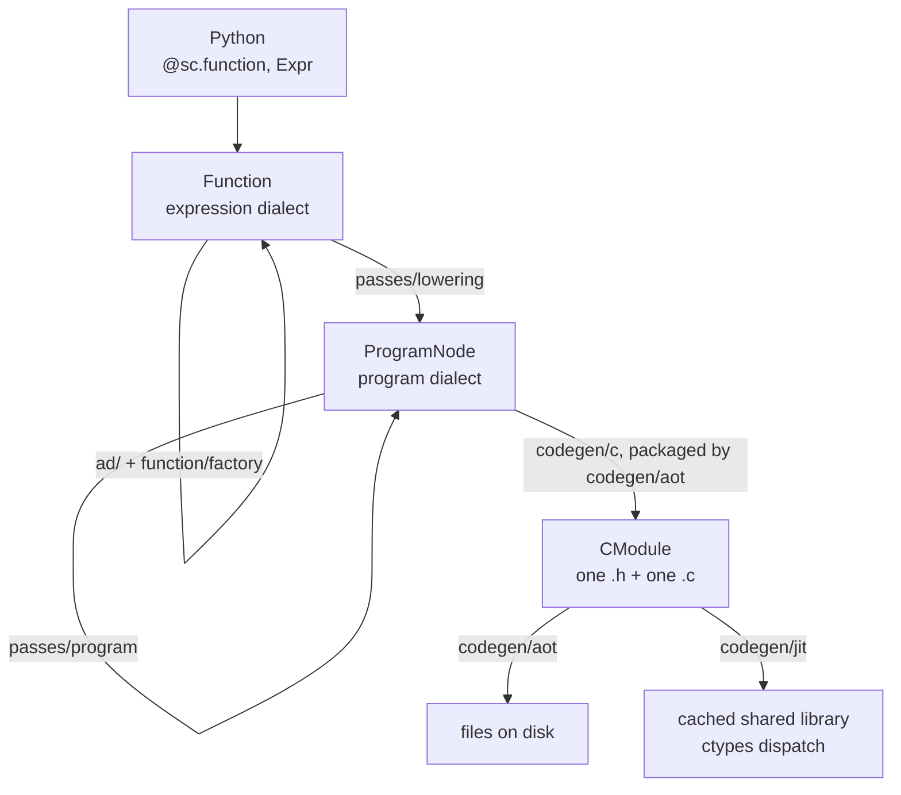

# Scaly architecture

Scaly turns symbolic models written in Python into compiled C. This page is the map of how that
happens: the pipeline at low resolution, one call followed through it, why there are two dialects,
and what each stage owns. The vocabulary of the dialects and of the C ABI (application binary
interface) have their own pages. The package map, the import layers and the rules for changing the
tree are developer concerns and live in [The codebase](../dev/codebase.md).

## The short version

Scaly has two intermediate representations and one direction of travel.

- The expression dialect (`ir/expr.py`) says what to compute: an immutable DAG of `Expr` nodes
  carrying shape, dtype and sparsity, hash-consed so that building the same node twice returns the
  same object. A `Function` names a graph and is the unit of composition, differentiation and
  compilation.
- The program dialect (`ir/program.py`) says how to compute it: `ProgramNode`s that spell out
  loops, buffers, loads, stores, calls and kernel launches.
- `passes/` holds every transformation: expression rewrites, the lowering from one dialect to the
  other, and program-dialect optimizations.
- `codegen/` renders the program dialect to C, then either writes it to disk (the ahead-of-time
  path, AOT) or compiles, caches and dispatches it in-process (the just-in-time path, JIT). There is
  no interpreter. Python calls, tests and generated C all take the same path, and gaps raise.
  The target is C rather than LLVM IR or an MLIR dialect because a `.c` file compiles with any
  toolchain, including the vendor compilers of embedded platforms, drops into the C and C++
  applications that consume it without a runtime, and keeps NumPy the only dependency; the
  vectorization that other compilers get from LLVM vector types comes from the GNU vector
  extension gcc, clang and `zig cc` share, with plain C as the opt-in fallback.
- Everything else hangs off that spine. `ad/` builds derivative graphs inside the expression
  dialect. `function/` is the user-facing frontend. `opt/` turns optimization problems into
  `Function`s through methods, the vendored QP and NLP (quadratic and nonlinear programming)
  solvers among them as opaque ones. `viz/` watches the pipeline without being part of it.



## Following one call

```python
import scaly as sc
import numpy as np


@sc.function(2, output="f")
def rosenbrock(x: sc.Expr) -> sc.Expr:
  return (1 - x[0]) ** 2 + 100 * (x[1] - x[0] ** 2) ** 2


grad = sc.gradient(rosenbrock, "f", "x")
grad(np.array([1.0, 2.0]))
```

| # | What happens | Where |
| --- | --- | --- |
| 1 | Every shape is declared, so the decorator makes fresh input symbols now, runs the body, and wraps the returned exprs in a `ConcreteFunction`. | `function/api.py`, `function/model.py` |
| 2 | `sc.factory.Grad("f", "x")` is a typed request object. `Function.factory` resolves the named input and output and calls the spec's `build`. | `function/model.py` (`factory`), `function/factory.py` (the specs) |
| 3 | `sc.factory.Grad`'s `build` is one reverse sweep over the expression DAG. Other kinds dispatch elsewhere: `sc.factory.Jac` batches forward mode over the identity, and `sc.factory.SpJac` colors a structural pattern first. | `ad/derivatives.py`, `ad/reverse.py` |
| 4 | The result is another `Function`, in the same dialect as the first. Nothing has been compiled yet. | `function/model.py` |
| 5 | Calling it with array leaves runs `__call__`, `numerical_call`, `_flat_numerical_call` and `_compile`, which reaches the backend through `_jit()`. That is the one place in the frontend that imports the backend, and the first of the [two sanctioned exceptions](../dev/codebase.md#the-two-sanctioned-exceptions) to import layering. | `function/model.py` |
| 6 | `CompiledFunction` asks `_build_artifact` for a shared library, which calls `render_c_module`. That lowers the function once into a render context every artifact reads from. | `codegen/jit.py`, `codegen/aot.py` |
| 7 | `lower_function` normalizes a private copy of each ordinary Function's outputs, then walks the expr DAG topologically; each `ExprOp` has one registered rule that emits program-dialect nodes. Callees become separate procedures; a Function carrying a solver descriptor stays opaque. | `passes/lowering.py` |
| 8 | `optimize_program` runs the fixed pipeline: `hoist_invariant`, `scalarize`, `prune_procedures`, `combine_scatter_sums`, `fuse_elementwise`, `fold_arith`, `unroll_unit_loops`, `fold_arith_after_unroll`, `delinearize_loops`, `pack_workspace`, `coalesce_stores`, `prepare_scalar`. | `passes/program/` |
| 9 | `verify_program` checks the result before anything renders it. | `ir/program_spec.py` |
| 10 | `render_program_c` emits the translation unit: the callee bodies, then the one entry point exported through the universal ABI, the single pointer-array C signature every generated function shares. | `codegen/c.py` |
| 11 | Header, source, workspace size and solver link flags are packaged as a `CModule`. | `codegen/aot.py` |
| 12 | A SHA-256 over (cache version, ABI signature, function name, source text, compiler path and version, compile flags) keys the artifact. On a miss, `cc` builds a shared library; then `dlopen` and a ctypes call through that ABI. The library is cached under `$XDG_CACHE_HOME/scaly/jit` (or `SCALY_CACHE_DIR`) and reused by every function with the same key. Step 6 asks an index keyed on the graph (`codegen/structure.py`) before it renders, and a library the index holds is loaded without steps 7 to 11. | `codegen/jit.py` |

AOT stops at step 11 and writes the pair to disk (`uv run scaly_codegen <module>:<attr> -o <dir>`).
Both consumers read the same `CModule`, so the header's `SZ_W`, the source's spill size and the
scratch array a caller has to allocate cannot disagree.

## The two dialects

Two IRs exist because the questions are different. `Expr` preserves mathematical meaning, so it
can be differentiated, simplified and compared structurally. `ProgramNode` has already chosen an
implementation (which loops run, which buffer holds which value, which device), so it can be
rendered but no longer differentiated.

They share as much machinery as they usefully can. Both are frozen, hash-consed node classes with
a `StrEnum` op tag and everything else encoded in args and attrs, in the tinygrad `UOp` style.
Both verify against the same `Rule` / `Spec` tables from `ir/spec.py` and raise the same
`VerifyError`. Both assembly listings live in `ir/text.py`. The one printer that does not is
`format_expr`, which `Expr.debug` calls and so has to stay in `ir/expr.py`.

Names follow the dialect. Expression things are `Expr*` (`ExprOp`, `verify_expr`, `spec_expr`) and
print with an `expr.*` prefix; program things are `Program*` (`ProgramOp`, `ProgramNode`,
`verify_program`) and print with `prog.*`. There is no third vocabulary; "semantic IR" and the old
`P`-prefixed names are gone, without aliases.

Verification is opt-in and explicit. Construction-time checks in `ir/expr.py` keep the common path
fast; a pass runs `verify_expr` / `verify_program` after a non-trivial rewrite, and negative tests
are written against them. `lower_function` verifies its output before it returns.

## Stage by stage

### Building: `function/`

`function/model.py` owns the two function classes. `ConcreteFunction` is one named graph: names,
shapes, sparsity metadata, the undeclared-input check, call composition, and `factory`; it is what
the rest of the compiler consumes. `Function`, its base class, is the template a decorated body
becomes when a shape is left to its calls. It binds each call's argument shapes, traces the body
once per binding and caches the instance under a name that spells them. A fully declared body is
its one instance, a `ConcreteFunction`, from the start. Compiler entry points take any `Function`
and use its one instance, which a template with holes refuses with `NotConcrete`. The module also
owns the dependency-light `DerivSpec` base at import layer 3. `function/api.py` is the ergonomic layer, the `@sc.function` decorator and the overloaded
wrappers (`sc.jacobian`, `sc.gradient`, `sc.sparse_hessian`, ...) that most user code calls.

`Function.factory(name, inputs, outputs)` is the derivative request API. Outputs are typed spec
objects (`sc.factory.Jac("eq", "z")`, `sc.factory.Grad("f", "x")`, `sc.factory.SpHess(...)`), one
frozen dataclass per kind in `function/factory.py`, each with its own `build`. There is no string
grammar to parse. Input names remain strings, including the `lam:<output>` and `fwd:<input>`
conventions `factory` creates for you; [Derivatives](../guide/derivatives.md) lists the kinds and
what each returns. A spec also owns its derived output's name, `{kind}_{of}_{wrt}`, and
`{kind}_{of}_{wrt}_{wrt}` for the two Hessian kinds. The generated C symbols are keyed on these
names, so a rename there moves symbols. Hess and SpHess always use the same input twice, so the
doubled `{wrt}` stays in those names.

`function/factory.py` owns the concrete derivative request classes and publicly re-exports the
base through `sc.factory`. The concrete requests import `ad`, so they stay at import layer 5.
`factory` stays a method; the request-to-AD dispatch is the part users can also reach through
`sc.factory`.

### Differentiating: `ad/`

Forward and reverse mode are independent implementations (`ad/forward.py`, `ad/reverse.py`);
`ad/derivatives.py` assembles whole Jacobians, gradients and Hessians from them. Everything
produces expression-dialect graphs; AD (automatic differentiation) is a graph-to-graph
transformation.

`ad/sparsity.py` contains no AD: structural patterns and greedy coloring, computed from graph shape
alone. `ad/sparse.py` is the half that needs AD, building compact nonzero-value expressions over a
colored pattern. Keeping the two apart lets `sparsity` sit at import layer 2 and be reused from
below.

Call and `VMAP` nodes are differentiated without expanding the callee, but differently in the two
modes. Forward mode builds a cached derivative `Function` for a callee output, propagates all
active formals together, then emits a call to it. Reverse mode inlines the callee's adjoint graph
for an ordinary call and caches one mapped adjoint `Function` for a `VMAP`. Either way, repeated
named structure, such as an RK4 stage inside a horizon constraint, is not re-walked once per
stage.

### Lowering: `passes/lowering.py`

Dispatch goes through the op registry: each op's lowering is a self-contained rule on its `OpDef`
(`@lowers(...)` for the builtins). An op with the `elementwise` trait needs no rule of its own: the
trait names the program op it computes and one shared rule lowers them all, so adding a scalar math
op is a trait and adding a structural op is a rule. The rule gets a `LowerCtx` whose public part
(buffers, `emit`, fresh names, the shared loops) is all an op defined outside the compiler needs.
`lower_function` normalizes private copies of the outputs while preserving Function policy and
metadata, walks the DAG topologically, emits one procedure per reached `Function`, deduplicates
callees, runs the optimization pipeline, and verifies.

An op or case outside the lowered subset raises `LoweringError`. There is no fallback, which is
what keeps generated C and Python agreeing.

### Optimizing: `passes/program/`

`PASS_PIPELINE` is an explicit tuple in `passes/program/__init__.py`; `optimize_program` runs it
at the tail of lowering. Imports do not determine execution order. An extension adds a pass at a
named slot, `insert_after("fuse_elementwise", name, fn)` or `insert_before`, and `pipeline()` is
the order that results.

- `hoist_invariant` splits a mapped callee whose arguments are partly the same at every trip into
  a prologue called once before the loop and a body that receives the prologue's buffers as extra
  inputs, so work derived only from broadcast arguments runs once per call instead of once per trip.
- `scalarize` expands selected small float64 procedures and eligible pure callees into shared
  scalar values, folds constants and identities, and schedules declarations and expression trees.
  Expression lowering hints control selection; automatic expansion preserves the entry point.
- `prune_procedures` removes unreachable procedures while retaining solver-oracle roots.
- `combine_scatter_sums` replaces sums of single-use zero-filled scatters with one zero-fill
  and one scatter-add per term.
- `fuse_elementwise` inlines a single-use elementwise, slice or gather producer into its one
  consumer, collapsing chains into one loop and deleting the intermediate buffer round-trip.
- `fold_arith` turns reads of constant buffers into constants, applies the arithmetic identities
  shared with the expression dialect (`passes/arith.py`) inside loop bodies, and makes a loop that
  fills a private buffer with one constant into a constant buffer.
- `unroll_unit_loops` erases statically empty loops and inlines single-iteration ones, after
  fusion has seen the loop-shaped form.
- `fold_arith_after_unroll` resolves arithmetic and constant reads exposed by loop substitution
  and prunes unused buffer declarations.
- `pack_workspace` lifetime-packs private buffers into shared slots and spills the large ones to
  the caller's `w[]`, which is what `f_SZ_W` reports. Without it the largest benchmark cells
  overflow the C stack.
- `coalesce_stores` pairs adjacent stores after physical aliases are known.
- `prepare_scalar` bounds statement expression depth using the scalarizer's shared scheduler. In a
  loop it also computes a select's loading branch ahead of it where that costs no skipped work, so
  that the C compiler can vectorize the loop.

Each pass that rebuilds an expression tree goes through `scaly.ir.match.rewrite`, the iterative
driver shared with the expression dialect (`passes/program/_common.py` holds the `rebuild_program`
adapter), so expression depth never becomes Python stack depth; see
[Lowering and optimization](lowering.md#deep-expressions).

### Rendering: `codegen/c.py`, `codegen/abi.py`

The renderer makes no lowering decisions. It walks the optimized program and spells each op in C
through compact per-op maps, honoring the `sz_w` and workspace offsets the packer set. The output
is one translation unit: `static` raw callee bodies (inline, or noinline for the clang
workaround in `_force_noinline_raw`), then the exported universal-ABI entry, so only the root is
exported and nested calls are direct.

`codegen/abi.py` owns the ABI itself: the entry signature, the status codes and symbol mangling.
The typed layers on top are an API, not the ABI: the C header's structs render in `codegen/aot.py`,
the C++ `Buffer` and namespace in `export/cpp.py`, and the CasADi 3.8 compatible symbols in
`export/casadi.py`. The signature follows CasADi's and everything is specified in
[The generated interface](generated_interface.md).

### Compiling: `codegen/aot.py`, `codegen/jit.py`

`codegen/aot.py` lowers once into a render context, and `CModule` reads everything off it: `body`
eagerly, then `header`, `source` and `link_flags` as cached properties. `link_flags` must stay
lazy; otherwise rendering a solver-bearing module requires the vendored libraries to be present
just to produce text.

`codegen/jit.py` consumes that same `CModule` and adds nothing to it. It keys the cache on a
SHA-256 over the cache version, the ABI signature, the function name, the source text, the
compiler and the compile flags, so two functions sharing a source skeleton but not a symbol still
get distinct artifacts. The compiler is `toolchain.compiler_identity`, its path and the first line
of its `--version` output, since clang and GCC 12 or later get the same flags.
`_JIT_CACHE_VERSION` is bumped when generated output changes incompatibly.

Rendering is most of what a cache hit used to cost, so the JIT asks a second key first, one that
needs no lowering. `codegen/structure.py` walks the Function's graph once and digests what
rendering reads of it: each node's op, arguments, type, name, value, attributes and lowering hint,
the Functions it calls taken the same way, and each extern body by the C it renders, the sources it
adds and what it links. Nodes, types and Functions are numbered in the order the walk first meets
them and kept alive until it ends, so the digest does not depend on addresses or on which of two
equal objects a node holds. What shapes every lowering and is no part of a graph goes in too: the
definition of each op the graph holds (its arity, its rules by name, its traits by value), the
pass pipeline with the passes extensions inserted, and the switch for in-place loop carries. With
the graph's digest go the target, the compiler and its flags, and a digest of the code that would
do the rendering: the path and contents of every file of scaly and of each package that defines a
rule, a pass or a class the graph uses (a file over a megabyte, a built library, by its size and
times). Where Python would run bytecode it kept from before a source's last change, that bytecode
is digested with the source. An index entry under that key names the library's directory and holds
the workspace size, the link flags and the isolation the handle needs.

The key is refused, and the Function rendered, in these cases:

- the walk meets a value of a type it does not know, a class defined inside a function, a subclass
  of a type or of `Target`, or a dataclass field its class leaves out of equality;
- a rule or a pass is a closure, a bound method, a partial application or an object that is called,
  whose state is in no file, or carries a name that does not lead back to it;
- a file, a link or a directory of the code was written, replaced or relinked after the code was
  loaded, or in the two seconds before, which is as fine as some file systems keep time. Scaly's
  own code is loaded with scaly; another package may have been imported any time since the process
  started, and where the platform does not say when that was, it has no digest;
- an extern body raises when asked for its C, or the libraries it links do not resolve;
- the graph is nested too deep for the walk, or holds a Function that is still a template;
- a render observer wants the Function.

A refusal costs a render. A key that missed something the rendering reads would load a stale
library, so `SCALY_JIT_KEY=verify` renders on every hit and raises when the source key, the
workspace, the link flags or the isolation differ from the entry's, and the suite runs under it.
That mode compares only what is built twice under one state of the process, so state that every
lowering reads is digested by name (the pass pipeline, the switch for in-place carries, the ops
fusion does not duplicate), and options, which rendering shares code with graph building to read,
cannot reach it at all. Lowering and rendering run under `default_options`, so such a read gets
the defaults and the C depends on the graph alone. An extension keeps what shapes its C in the
files of the package that registers it, and out of globals set at run time, which no digest sees.
The index keeps the entries of the
eight states of the code used last, since each edit of a checkout leaves a state nothing finds
again. On Linux,
solver-bearing artifacts load into an isolated linker namespace to keep vendored dependencies out
of the host process.

The CLI is `scaly_codegen`. `codegen/__init__.py` imports `.aot`, so running
`python -m scaly.codegen.aot` directly would execute it a second time as `__main__` and leave two
copies of the observer registry, letting a CLI render escape a recorder that was armed elsewhere.
The `python -m scaly.codegen` shim remains available for compatibility.

### Solvers: `opt/`, `plugins/`

`sc.opt.problem(...)` declares a typed problem that names no solver. `sc.opt.solver(problem, method)` returns a plain
`Function` whose body is `ExprOp.EXTERN_CALL` nodes sharing a `SolverDescriptor`. Calling it with
`Expr` leaves returns the declared expression tree, so a solver nests directly inside a larger
graph. `EXTERN_CALL` has no derivative rule: a derivative that reaches one raises, its structural
sparsity is dense in every argument, and `custom_derivative` supplies a rule.

A Function with an extern body is the one sanctioned render path outside the program dialect. The
compiler knows it only through the extern-callee protocol in `function/extern.py`: the Functions
its C calls, the hand-written C sources it adds, the C that defines it, and what compiling and
loading the translation unit needs (includes, type definitions, prototypes, link flags, a state
accessor). A `SolverDescriptor` implements the protocol in `opt/external/wrapper.py`, which frames a
body produced by the plugin's `render_wrapper` hook with the stats storage, the `Info` outputs and
the accessor; the plugin drives the vendored C API directly. Everything else in such a graph, the oracle functions
the wrapper calls and the host function that calls the solver, lowers through the program dialect
like anything else, and `codegen/aot.py` orders the single translation unit.

The solvers ship as separate distributions under `plugins/`, each a method class declared in the
`scaly.methods` entry points and found by the registry in `opt/method.py` (`function/method.py`
holds the machinery every domain shares). `opt/external/paths.py` finds their vendored libraries
and headers; `opt/external/graph.py` answers the queries the backend asks about a graph (is this a
solver, what does it reach, which flags does it need). The plugin contract is
[Solver plugins](../dev/solver_plugins.md); the user-facing interface is
[Solvers](../guide/solvers.md).

### Observing: `viz/`

`viz/recording.py` registers a factory into `codegen/aot.py`'s observer hook. When a function has
been marked with `visualize(...)`, a render produces an observer that captures the expression
graph, each Function's normalized outputs, the lowered program, each pass result, and the
generated C. Nothing is recorded otherwise. `viz/graph.py` owns presentation (graph JSON, colors,
labels), while the stable, diffable assembly text stays in `ir/text.py`, where the compiler owns
it.

## Where the rest is written down

- [The intermediate representations](ir.md): the two dialects, their operations, types and verifiers
- [Lowering and optimization](lowering.md): the rule registry, the passes, the known limits
- [Differentiation](autodiff.md): how AD crosses calls and mapped structure
- [The generated interface](generated_interface.md): the pointer ABI, then the C, C++ and CasADi layers on top of it
- [Solvers](solvers.md): what typed problem and solver construction assemble underneath
- [Influences](influences.md): what scaly took from CasADi, tinygrad, MLIR and JAX
- [The codebase](../dev/codebase.md): the package map, import layers and where to add things
- [Solver plugins](../dev/solver_plugins.md): the plugin protocol and the `render_wrapper` contract
