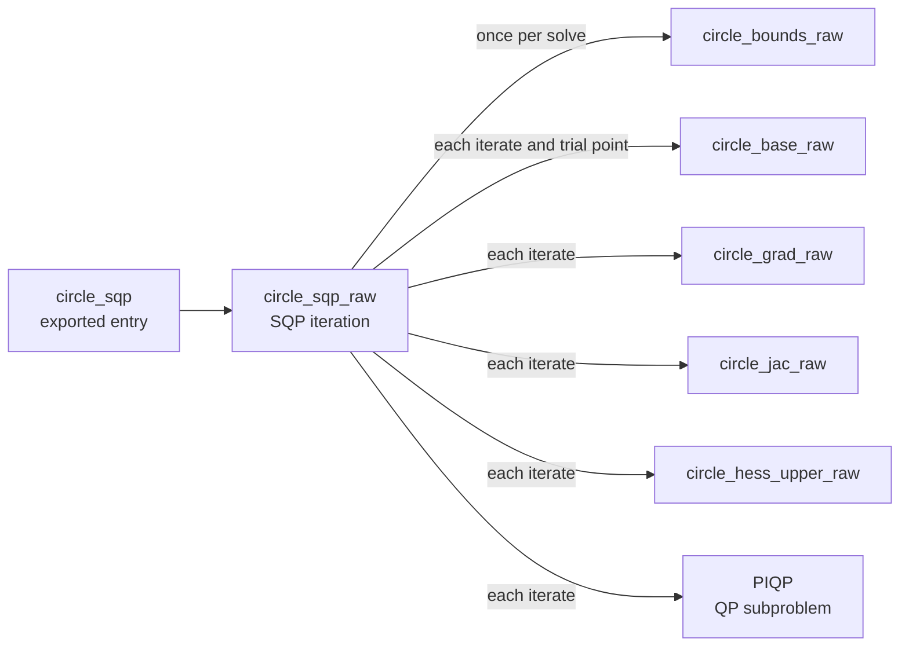

# How solvers work

A solver needs the problem's values and derivatives many times per solve.
Scaly generates each of those quantities as a C procedure, called an *oracle*,
and a solver plugin supplies a C wrapper that drives a native solver with them.
The whole solve runs in generated C without returning to Python.

The [solver guide](../guide/solvers.md) covers declaring, calling and
exporting a solver, and [solver backends](../guide/solver_backends.md) covers
what each backend accepts. This page explains what `sc.solver` builds and what
the generated wrappers do.

## One solve per descriptor

`sc.solver` returns a `Solver` whose `function` is an ordinary `Function`. Its
outputs are `expr.solver_call` nodes that all carry the same
`SolverDescriptor`, the record of everything the plugin needs: dimensions,
oracles, sparsity patterns and options. Nesting the allocation solver from the
guide in a larger function and printing `sc.render_expr_assembly(allocate)`
shows both levels:

```python
@sc.function(sc.arg("target", 2), outputs=sc.group(sc.arg("allocation"), sc.arg("lam_eq")))
def allocate(target: sc.Expr) -> tuple[sc.Expr, sc.Expr]:
    u, _, lam_eq, _ = solve(target)
    return 2.0 * u, lam_eq
```

With the long `solver=SolverDescriptor(...)` attribute replaced by `...`:

```
expr.module {
  expr.func @allocation_piqp(%u: tensor<2xfloat64>, %lam:u: tensor<2xfloat64>, %lam_eq: tensor<1xfloat64>, %lam_ineq: tensor<0xfloat64>, %target: tensor<2xfloat64>) -> (%u: tensor<2xfloat64>, %lam:u: tensor<2xfloat64>, %lam_eq: tensor<1xfloat64>, %lam_ineq: tensor<0xfloat64>) {
    %0 = expr.input {lowering="auto", name="u"} : tensor<2xfloat64>
    %1 = expr.input {lowering="auto", name="lam:u"} : tensor<2xfloat64>
    %2 = expr.input {lowering="auto", name="lam_eq"} : tensor<1xfloat64>
    %3 = expr.input {lowering="auto", name="lam_ineq"} : tensor<0xfloat64>
    %4 = expr.input {lowering="auto", name="target"} : tensor<2xfloat64>
    %5 = expr.solver_call(%0, %1, %2, %3, %4) {output=0, output_name="u", solver=...} : tensor<2xfloat64>
    %6 = expr.solver_call(%0, %1, %2, %3, %4) {output=1, output_name="lam:u", solver=...} : tensor<2xfloat64>
    %7 = expr.solver_call(%0, %1, %2, %3, %4) {output=2, output_name="lam_eq", solver=...} : tensor<1xfloat64>
    %8 = expr.solver_call(%0, %1, %2, %3, %4) {output=3, output_name="lam_ineq", solver=...} : tensor<0xfloat64>
    expr.return %5, %6, %7, %8
  }
  expr.func @allocate(%target: tensor<2xfloat64 diff>) -> (%allocation: tensor<2xfloat64>, %lam_eq: tensor<1xfloat64>) {
    %0 = expr.const {lowering="auto", value=2.} : tensor<float64>
    %1 = expr.const {lowering="auto", value=[0., 0.]} : tensor<2xfloat64>
    %2 = expr.const {lowering="auto", value=[0.]} : tensor<1xfloat64>
    %3 = expr.const {lowering="auto", value=[]} : tensor<0xfloat64>
    %4 = expr.input {lowering="auto", name="target"} : tensor<2xfloat64 diff>
    %5 = expr.call(%1, %1, %2, %3, %4) {callee="allocation_piqp", output=0} : tensor<2xfloat64>
    %6 = expr.mul(%0, %5) : tensor<2xfloat64>
    %7 = expr.call(%1, %1, %2, %3, %4) {callee="allocation_piqp", output=2} : tensor<1xfloat64>
    expr.return %6, %7
  }
}
```

The caller sees an ordinary call with zero constants for the initial values.
The four `solver_call` nodes differ only in `output`, and the descriptor
compares by identity, so they stay four views of one solve. Lowering treats
the solver function as opaque. It lowers the oracles to procedures and
replaces both call nodes with a single call that writes all four results,
including the two that `allocate` never reads. The program for `allocate`,
trimmed to the call:

```
prog.call @allocation_piqp(%k1, %k1, %k2, %k3, %target, %s0, %s1, %s2, %s3) {callee_needs_w=False, n_in=5, n_out=4, w_self=0}
```

The solver function has no expression body to differentiate, which is why a
derivative through it is zero, as the
[guide warns](../guide/solvers.md#nesting-a-solver-in-a-graph).

## The oracles of a nonlinear program

For IPOPT and Scaly SQP, Scaly concatenates the variable blocks into one
vector \(x\) and stacks the constraints as

\[
c(x,p)=\begin{bmatrix}h(x,p)\\ g(x,p)\end{bmatrix},
\]

equalities first, then the bounded inequalities in the order of the `ineq`
tuple. The Lagrangian weights the objective and the stacked constraints,

\[
\mathcal{L}(x,p,\sigma,\lambda)=\sigma f(x,p)+\lambda^\top c(x,p),
\]

and its Hessian with respect to \(x\) is the curvature information both
methods use[^nw]. Five oracles supply everything:

| Oracle                  | Inputs                      | Outputs                            |
| ----------------------- | --------------------------- | ---------------------------------- |
| `<problem>_base`        | \(x\), \(p\)                | `f`, and `g` holding \(c\)         |
| `<problem>_grad`        | \(x\), \(p\)                | \(\nabla f\)                       |
| `<problem>_jac`         | \(x\), \(p\)                | nonzeros of \(\partial c/\partial x\) |
| `<problem>_hess_<tri>`  | \(x\), \(p\), \(\sigma\), \(\lambda\) | nonzeros of one triangle of \(\nabla^2_{xx}\mathcal{L}\) |
| `<problem>_bounds`      | \(p\)                       | variable bounds, inequality bounds |

The backend declares which Hessian triangle it wants: IPOPT takes the lower
one and Scaly SQP the upper one. The problem caches the four
triangle-independent oracles and each triangle separately, so building an
IPOPT and an SQP solver for the same problem differentiates it once and only
extracts a second triangle. Missing bounds are \(\pm\infty\) in the oracle
output. Each wrapper converts them to its solver's own convention, such as
\(\pm 2\times 10^{19}\) for IPOPT.

## The wrapper calls the oracles

For a problem named `circle` solved with Scaly SQP, the generated file
contains these calls:



The entry checks pointers and calls the wrapper, and the wrapper is the only
part written by the plugin. The oracles are lowered and optimized like any
other function, and the sparsity patterns of the Jacobian and Hessian are
fixed, so the wrapper holds them as static index tables and only refills
values. [Generated code and compilation](generated_interface.md#module-layout)
shows where each piece sits in the file.

What persists between calls differs by backend:

| Backend   | Native state across calls                                              |
| --------- | ---------------------------------------------------------------------- |
| PIQP      | one workspace, set up on the first call and updated on later calls     |
| IPOPT     | none, the problem is recreated each call because its bounds can change |
| Scaly SQP | a PIQP workspace set up per solve, updated each iteration, then freed  |

## Quadratic programs

A QP backend receives matrices instead of oracles for \(f\) and \(c\). Scaly
first checks that the problem is quadratic, then evaluates derivatives at
\(x=0\) to extract the data. Consider

\[
\min_{u\ge 0}\ \lVert u-r\rVert^2+u_0u_1
\quad\text{s.t.}\quad u_0+u_1-1=0,\quad
-0.5\le u_0-2u_1+1\le r_0 .
\]

```python
import numpy as np
import scaly as sc


@sc.problem(vars=sc.arg("u", 2), params=sc.arg("r", 2))
def allocation(u: sc.Expr, r: sc.Expr) -> sc.ProblemSpec[sc.Expr]:
    return sc.ProblemSpec(
        minimize=sc.sumsqr(u - r) + u[0] * u[1],
        eq=(u.sum() - 1.0,),
        ineq=(sc.bounded(u[0] - 2.0 * u[1] + 1.0, lo=-0.5, hi=r[0]),),
        lb=sc.const(0.0),
    )


solve = sc.solver(allocation, "piqp")
oracle = solve.function.instantiate().descriptor.oracle
for name, value in zip(oracle.output_names, oracle(np.array([0.2, 0.8]))):
    print(f"{name:12} {np.asarray(value).tolist()}")
```

The oracle maps the parameters to every QP buffer. At \(r=(0.2, 0.8)\) it
prints:

```
qp:P         [2.0, 1.0, 1.0, 2.0]
qp:c         [-0.4, -1.6]
qp:A_eq      [1.0, 1.0]
qp:b_eq      [1.0]
qp:G_ineq    [1.0, -2.0]
qp:l_ineq    [-1.5]
qp:u_ineq    [-0.8]
qp:x_lb      [0.0, 0.0]
qp:x_ub      [inf, inf]
```

That is the QP

\[
P=\begin{bmatrix}2&1\\1&2\end{bmatrix},\quad
c=\begin{bmatrix}-0.4\\-1.6\end{bmatrix},\quad
A=\begin{bmatrix}1&1\end{bmatrix},\ b=1,\quad
G=\begin{bmatrix}1&-2\end{bmatrix},\ -1.5\le Gu\le -0.8 .
\]

Each buffer comes from one rule:

| Buffer            | Extraction                                                 |
| ----------------- | ---------------------------------------------------------- |
| `P`               | objective Hessian                                          |
| `c`               | objective gradient at \(x=0\)                              |
| `A_eq`            | Jacobian of the equalities                                 |
| `b_eq`            | minus the equality residual at \(x=0\), for \(Ax=b\)       |
| `G_ineq`          | Jacobian of the inequalities                               |
| `l_ineq`, `u_ineq`| declared bounds minus the inequality expression at \(x=0\) |
| `x_lb`, `x_ub`    | variable bounds                                            |

The constant `+1.0` inside the inequality moved into its bounds:
\(-0.5-1=-1.5\) and \(r_0-1=-0.8\).

### The quadratic check uses dependencies

The check never evaluates the problem. It differentiates symbolically and asks
the [sparsity analysis](../guide/sparsity.md) whether the result still depends
on \(x\). The objective Hessian must not depend on \(x\), nor may the
constraint Jacobians or the bounds. The check fails with the part that broke
it:

```python
@sc.problem(vars=sc.arg("u", 2), params=sc.arg("r", 2))
def curved(u: sc.Expr, r: sc.Expr) -> sc.ProblemSpec[sc.Expr]:
    return sc.ProblemSpec(minimize=sc.sumsqr(u - r), eq=(u[0] * u[1] - 1.0,))

sc.solver(curved, "piqp")
# NotQuadratic: curved: eq[0] is not affine in the variables
```

Because the answer is structural, no test point can accept a nonlinear problem
by luck. The price is that an identity the simplifier does not know is
rejected: adding `u[0].sin() ** 2 + u[0].cos() ** 2`, which is always one, to
the objective raises `NotQuadratic: cost is not quadratic in the variables`.
A term that simplification removes, such as `0.0 * u[0] ** 3`, is accepted.

### Sparse QP data

With `options={"sparse": True}` each matrix gets a fixed compressed sparse
column pattern and the oracle emits only its values. An entry is in the
pattern if it is nonzero when the oracle is evaluated at random parameter
values, or if it depends on a parameter at all, so an entry that happens to be
zero at one parameter value is still kept. `P` keeps its upper triangle only.
For the example above, the `P` values become `[2.0, 1.0, 2.0]` at rows
`(0, 0, 1)` and columns `(0, 1, 1)`.

## Scaly SQP

Scaly SQP is a sequential quadratic programming method[^nw]. At each iterate
\(x_k\) with multipliers \(\lambda_k\) it solves, with PIQP[^piqp], the
subproblem

\[
\begin{aligned}
\min_d\quad & \tfrac12 d^\top B_k d+\nabla f(x_k)^\top d \\
\text{s.t.}\quad & \nabla h(x_k)\,d=-h(x_k), \\
& g_{\mathrm{lb}}-g(x_k)\le\nabla g(x_k)\,d\le g_{\mathrm{ub}}-g(x_k), \\
& x_{\mathrm{lb}}-x_k\le d\le x_{\mathrm{ub}}-x_k ,
\end{aligned}
\]

then takes a step \(x_{k+1}=x_k+\alpha d\) accepted by the line search, and
moves the multipliers the same fraction \(\alpha\) toward the subproblem's
multipliers. The initial variables are first clamped to their bounds.

The method follows the SQP solver of laOPT[^laopt]: the same subproblem, the
same filter line search and \(\ell_1\) merit function with an optional
watchdog, and a stopping test on the same three measures. It differs in two
ways. laOPT has an elastic mode that relaxes the linearized constraints so
that every subproblem is feasible. Scaly SQP has none and continues from
whatever point PIQP returns. laOPT also uses a Gauss-Newton Hessian by
default, with an optional diagonal shift from Gershgorin's theorem, while
Scaly SQP uses the exact Lagrangian Hessian and repairs it as described next.

### Hessian regularization

PIQP needs a positive definite \(B_k\), and the Lagrangian Hessian of a
nonconvex problem is not. The wrapper repairs it on a pattern fixed at code
generation: the upper triangle of the Hessian, the full diagonal and, if there
are equalities, the pattern of \(A^\top A\), where \(A=\nabla h(x_k)\).

1. Assemble \(B=\nabla^2_{xx}\mathcal{L}+\nu A^\top A+\delta I\), where
   \(\delta\) is the `regularization` option and \(\nu=0\) at first. The
   \(\delta I\) term is always added.
2. Factorize \(B=LDL^\top\) with a sparse factorization whose symbolic
   analysis is also done at code generation[^ldl]. Whenever a pivot \(d_k\)
   falls below \(\delta\), raise it to \(\max(|d_k|,\delta)\) and add the same
   amount to \(B_{kk}\). Only the diagonal changes, so the factorization is
   exactly that of \(B+E\) for a diagonal \(E\), in the spirit of modified
   Cholesky methods[^nw].
3. With equalities, if \(E\neq 0\), start again from step 1 with
   \(\nu=1,10,100,\dots\), up to ten attempts in all. Adding \(\nu A^\top A\)
   leaves the curvature along the linearized constraints unchanged and makes
   \(B\) positive definite once \(\nu\) is large enough, as long as the
   curvature along the constraints is positive, the same argument as for the
   augmented Lagrangian[^nw]. A diagonal shift would instead distort the step
   within the constraints.
4. If \(E\) is still nonzero after that, the exact Hessian has negative
   curvature along the constraints too. The wrapper evaluates the Hessian
   again with \(\lambda=0\), which is the objective Hessian, sets \(\nu=0\) and
   repeats step 2 once, accepting whatever \(E\) it produces.

Without equalities only steps 1 and 2 run. With `hessian="objective"`,
\(\lambda=0\) from the start. Raising a small pivot to its magnitude, rather
than clamping it to \(\delta\), matters in practice: dividing by near-zero
pivots drives later pivots negative and the shift grows without bound.

The `trace` option prints the largest diagonal addition as `shift`. For

\[
\min_x\ \tfrac14x_0^4-\tfrac12x_0^2+(x_1-p)^2
\]

started at \(x=(0.1, 0)\), the curvature \(3x_0^2-1\) is \(-0.97\). The pivot is
raised to \(0.97\), a shift of \(1.94\). The shift disappears once \(x_0\) is
past \(1/\sqrt3\), after which the iteration converges quickly. The trace,
filtered to the lines that report each QP step:

```
[scaly-sqp saddle_sqp] iter=1 qp_status=1 qp_iter=1 primal=0.000e+00 step_inf=1.000e+00 shift=1.940e+00
[scaly-sqp saddle_sqp] iter=2 qp_status=1 qp_iter=0 primal=0.000e+00 step_inf=2.209e-01 shift=1.755e+00
[scaly-sqp saddle_sqp] iter=3 qp_status=1 qp_iter=0 primal=0.000e+00 step_inf=7.494e-01 shift=9.268e-01
[scaly-sqp saddle_sqp] iter=4 qp_status=1 qp_iter=0 primal=0.000e+00 step_inf=1.405e-01 shift=0.000e+00
[scaly-sqp saddle_sqp] iter=5 qp_status=1 qp_iter=0 primal=0.000e+00 step_inf=3.040e-02 shift=0.000e+00
[scaly-sqp saddle_sqp] iter=6 qp_status=1 qp_iter=0 primal=0.000e+00 step_inf=1.410e-03 shift=0.000e+00
```

`qp_status=1` is `PIQP_SOLVED`. The solve ends with status `OK` after six
iterations at \(x\approx(1, 1)\) for \(p=1\).

### Stopping and failure rules

The iteration stops with `OK` when the largest constraint or bound violation
is at most `tol`, and both the largest complementarity product and the largest
entry of \(\nabla f+\nabla c^\top\lambda+\lambda_{\mathrm{box}}\) are at most
`dual_tol`. Every other outcome is one of these:

| Event                                                              | Outcome                                  |
| ------------------------------------------------------------------ | ---------------------------------------- |
| a NaN bound, a lower bound above its upper bound, or a non-finite initial value | `NUMERICS` before the first iteration |
| a non-finite value, gradient, Jacobian or Hessian at an iterate    | `NUMERICS`                               |
| PIQP returns solved, iteration limit, primal or dual infeasible    | the step is PIQP's returned point, judged by the line search and the stopping test |
| PIQP returns any other status                                      | `NUMERICS`                               |
| a trial point with a non-finite value                              | the trial is rejected and the step shortened |
| no trial accepted after 100 trials or once \(\alpha<10^{-4}\)      | `NUMERICS`                               |
| `max_iter` iterations without meeting the stopping test            | `MAX_ITER`                               |

Scaly SQP never reports `ACCEPTABLE`. The statistics keep the last PIQP status
in `native_status`, so a `NUMERICS` caused by the subproblem can be told apart
from one caused by the model. The line search itself is the filter method of
Fletcher and Leyffer[^filter] by default, with an \(\ell_1\) merit function as
the alternative, as described in the [backend
guide](../guide/solver_backends.md#scaly-sqp).

## IPOPT and PIQP

IPOPT is a primal-dual interior-point method with a filter line search[^ipopt].
Its wrapper registers the oracles as the evaluation functions of IPOPT's C
interface, along with the fixed Jacobian and lower-triangle Hessian index
tables. PIQP is a
proximal interior-point method for convex QPs[^piqp]. Its wrapper evaluates the
QP oracle once per solve, converts dense matrices from row-major to PIQP's
column-major layout, and passes sparse values directly because they are
already in compressed column order.

[Solver plugins](../dev/solver_plugins.md) describes the interface for adding
another backend.

[^nw]: J. Nocedal and S. J. Wright, *Numerical Optimization*, 2nd ed.,
    Springer, 2006. Chapter 18 covers SQP and the Lagrangian Hessian, section
    3.4 Hessian modification, and chapter 17 the augmented Lagrangian.
    [doi:10.1007/978-0-387-40065-5](https://doi.org/10.1007/978-0-387-40065-5)

[^ipopt]: A. Wächter and L. T. Biegler, "On the implementation of an
    interior-point filter line-search algorithm for large-scale nonlinear
    programming", *Mathematical Programming* 106(1), 25-57, 2006.
    [doi:10.1007/s10107-004-0559-y](https://doi.org/10.1007/s10107-004-0559-y)

[^piqp]: R. Schwan, Y. Jiang, D. Kuhn and C. N. Jones, "PIQP: A proximal
    interior-point quadratic programming solver", *62nd IEEE Conference on
    Decision and Control (CDC)*, 2023.
    [doi:10.1109/CDC49753.2023.10383915](https://doi.org/10.1109/CDC49753.2023.10383915)

[^filter]: R. Fletcher and S. Leyffer, "Nonlinear programming without a
    penalty function", *Mathematical Programming* 91(2), 239-269, 2002.
    [doi:10.1007/s101070100244](https://doi.org/10.1007/s101070100244)

[^ldl]: T. A. Davis, "Algorithm 849: A concise sparse Cholesky factorization
    package", *ACM Transactions on Mathematical Software* 31(4), 587-591, 2005.
    [doi:10.1145/1114268.1114277](https://doi.org/10.1145/1114268.1114277)

[^laopt]: J. Waibel, R. Schwan and C. N. Jones, "laOPT: A native C++ optimal
    control toolbox for high-performance implementations, and application to
    racing", *10th IEEE Conference on Control Technology and Applications
    (CCTA)*, 2026.
    [Infoscience](https://infoscience.epfl.ch/handle/20.500.14299/266837),
    code at [PREDICT-EPFL/laopt](https://github.com/PREDICT-EPFL/laopt)
