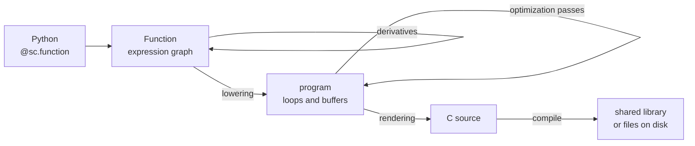

{ width="320" }
{ width="320" }

Scaly is a symbolic compiler for optimal control, written in Python. You write dynamics, costs and
constraints as named functions over a typed expression graph. Scaly differentiates them, works out
their sparsity, and generates standalone C. The C is compiled and cached on the first call from
Python, and the same C can be written to disk for a build that has no Python in it.

!!! note "Early release"
    Scaly is at version 0.1.0a1. The public API can still change between minor versions, and
    [Versioning](dev/versioning.md) says what a change is allowed to break.

```python
import scaly as sc
import numpy as np

@sc.function(sc.L("x", 2), sc.L("f", ...))
def rosenbrock(x: sc.Expr) -> sc.Expr:
    return (1 - x[0]) ** 2 + 100 * (x[1] - x[0] ** 2) ** 2

rosenbrock(np.array([1.0, 2.0]))          # array(100.)

grad = sc.gradient(rosenbrock, "f", "x")
grad(np.array([1.0, 2.0]))                # array([-400.,  200.])
```

The first call lowered the graph, rendered C, compiled a shared library and cached it. There is no
Python evaluator behind these calls, so the values you test against are computed by the same C you
ship. To render that C to files instead:

```bash
uv run scaly_codegen mymodule:rosenbrock -o generated/
```

## What it does

Derivatives are graphs. `sc.gradient`, `sc.jacobian`, `sc.hessian`, `sc.lagrangian_hessian` and
their sparse forms return ordinary functions, which compile, nest and differentiate again like any
other. A derivative keeps the input tree of the function it came from.

Sparsity is computed from the graph structure before any value exists. Jacobians and Hessians are
colored and the generated code computes only the nonzeros. The header carries the pattern as index
tables, so a consumer can assemble a sparse matrix without asking Python.

Repetition is preserved. `sc.vmap` evaluates one function over a horizon of stages as a single
node, and that node stays a loop through differentiation, lowering and code generation. A hundred
identical stages produce one loop body, not a hundred copies.

Solvers are functions. `sc.problem` declares a problem without naming a backend, and `sc.solver`
turns it into a function that calls PIQP, IPOPT or scaly's own generated SQP. A solver can sit
inside a larger graph, and the whole graph compiles into one shared library.

Every generated function has the same C signature, the one CasADi uses, plus optional typed C++
wrappers. See [the C ABI](how_it_works/c_abi.md).

The compiler is about ten thousand lines of Python with two intermediate representations. NumPy
holds values and SciPy is used for structural sparsity analysis. There are no other runtime
dependencies.

[Benchmark results](results/index.md) compares generated Hessians and closed-loop controllers
against CasADi, and [Are the comparisons fair?](results/fairness.md) says what each comparison holds
constant. The outcome depends on the workload, and both pages say where scaly is slower.

## Where to start

<div class="grid cards" markdown>

- **New here**

    [Installation](guide/installation.md), then [Getting started](guide/getting_started.md):
    one function, one derivative, one solver call, and the generated C.

- **Building a model**

    [Building functions](guide/functions.md), [Derivatives](guide/derivatives.md),
    [Sparsity](guide/sparsity.md), [Solvers](guide/solvers.md).

- **How it works**

    [Architecture](how_it_works/architecture.md) for the shape of the compiler.
    [Next to its neighbours](how_it_works/comparison.md) if you know CasADi, JAX, tinygrad or MLIR.

- **Comparing against CasADi**

    [Benchmark results](results/index.md), measured against CasADi SX and MX.

</div>

## How it fits together



The expression graph says what to compute. Differentiation and simplification work on it. The
program says how, with explicit loops, buffers and memory, and the optimization passes work on
that. [Architecture](how_it_works/architecture.md) has the full map.

## Status

Working today: the full expression set on the host, forward and reverse differentiation, colored
sparse Jacobians and exact sparse Lagrangian Hessians through preserved `vmap` structure, and
PIQP, IPOPT and a generated-C SQP solver callable from inside a compiled graph. Linux and macOS,
Python 3.12 or newer.

Not yet: differentiating through a solver call (its derivatives are zero), warm-start handover
into PIQP, Windows, and any target other than the host CPU.

## Acknowledgements

Scaly is developed at EPFL in the PREDICT group. The research behind it is funded by the Swiss
National Science Foundation through NCCR Automation (grant agreement 51NF40_180545).

Parts of the code and of this documentation were written with AI coding agents (Claude, Codex and
others), under the direction and review of the authors, who are responsible for the result.
