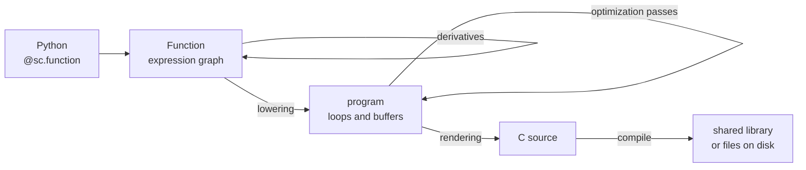

# scaly

**Make your optimal control problems scale.**

Scaly is a symbolic compiler for optimal control. You describe dynamics, costs and constraints as
named functions over a typed expression graph; scaly differentiates them, exploits their sparsity,
and generates efficient, small and standalone C that runs with no Python anywhere near it.

!!! warning "Under active development"
    Scaly is pre-1.0 and the API still moves. Breaks are deliberate and documented, but they do
    happen — see [Versioning](dev/versioning.md).

```python
import scaly as sc
import numpy as np

@sc.function(sc.L("x", 2), sc.L("f", ...))
def rosenbrock(x: sc.Expr) -> sc.Expr:
    return (1 - x[0]) ** 2 + 100 * (x[1] - x[0] ** 2) ** 2

rosenbrock(np.array([1.0, 2.0]))          # 100.0

grad = sc.gradient(rosenbrock, "f", "x")
grad(np.array([1.0, 2.0]))                # array([-400.,  200.])
```

The first call compiled that function to C, built a shared library and cached it — the just-in-time
path (JIT). There is no interpreter behind scaly — what you test from Python is the artifact you
deploy.

The same compiler renders the same C to files for someone else to build, which is the ahead-of-time
path (AOT):

```bash
uv run python -m scaly.codegen mymodule:rosenbrock -o generated/
```

## What it is for

- **Derivatives that stay small.** Gradients, Jacobians, Hessians and Lagrangian Hessians, dense or
  sparse, as efficient and small as possible.
- **Sparsity as a first-class property.** Structural patterns are derived symbolically, colored,
  and turned into code that computes only the nonzeros — with the pattern carried into the
  generated header.
- **Structure that survives codegen.** codegenerating the same function evaluated in a loop preserves the loop through
  differentiation and code generation, so a hundred-stage horizon produces roughly the code of a
  one-stage horizon.
- **Solvers as graph nodes.** `sc.problem(...)` declares a backend-free problem and `sc.solver(...)` returns a real function, so a solver
  can be nested inside a larger model and the whole thing compiles into one artifact that links
  against PIQP or IPOPT directly.
- **One C ABI.** A single CasADi-style signature per generated function, plus optional typed C++
  wrappers over it.
- **A compiler you can read.** Pure Python, with NumPy for values and SciPy only for structural
  sparsity analysis, two small intermediate representations, and a well-documented architecture.

The current study shows a workload-dependent result. Scaly trails CasADi SX on the race-car
Hessian, but leads the fastest completed CasADi encoding on the neural-process model
predictive control and safety-filter sweeps. The controlled closed-loop runs separate function
evaluation from shared solver work. See [the current results](results/index.md) and the
[fairness audit](results/fairness.md).

## Where to start

<div class="grid cards" markdown>

- **New here**

    [Installation](guide/installation.md) then
    [Getting started](guide/getting_started.md) — one function, one derivative, the generated C.

- **Building a model**

    [Building functions](guide/functions.md), [Derivatives](guide/derivatives.md),
    [Sparsity](guide/sparsity.md), [Solvers](guide/solvers.md).

- **Curious how it works**

    [Architecture](how_it_works/architecture.md) for the shape of the compiler, or
    [Scaly next to its neighbours](how_it_works/comparison.md) if you already know CasADi, JAX,
    tinygrad or MLIR.

- **Comparing against CasADi**

    [Benchmark results](results/index.md) — measured against CasADi SX and MX, kept current.

</div>

## How it fits together



Two intermediate representations and one direction of travel. The expression graph says *what* to
compute and is what differentiation and simplification work on; the program says *how*, with
explicit loops, buffers and memory. [The architecture](how_it_works/architecture.md) has the full
map.

## Status

Scaly generates C for the full expression set on the host, differentiates it forward and in
reverse, produces colored sparse Jacobians and exact sparse Lagrangian Hessians through preserved
`VMAP` structure, and drives PIQP, IPOPT and its own generated-C SQP solver from inside a compiled
graph.

Open work: iterative rather than recursive passes, warm-start handover into PIQP, differentiating
through a solve, and a GPU backend. See [Benchmark results](results/index.md) for where it currently stands against
CasADi.
