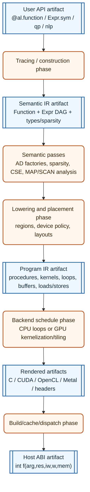
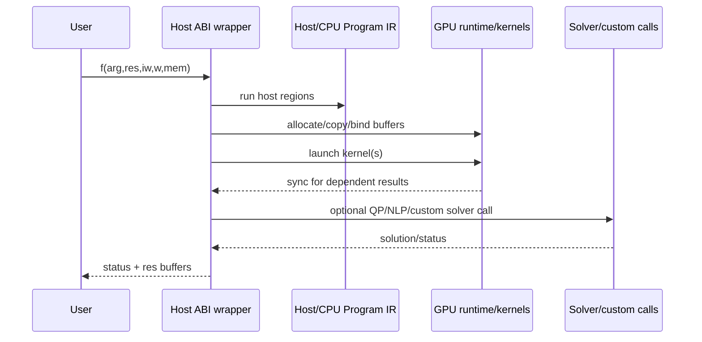

# Alloy roadmap: semantic IR to program IR

This roadmap replaces the original proof-of-concept phase plan. The previous roadmap proved the core idea: named `Function`s over a sparse typed expression graph, derivative factories, call nodes, MAP-based loop preservation, scalar C codegen, JIT, and solver wrappers can match CasADi-style control workloads while producing much smaller generated source on the benchmark cases.

The next objective is architectural polish: make the compiler pipeline explicit enough to support GPU backends, higher-order tensor/linalg semantics, structured sparsity, and custom solver generation without turning the current `Expr` graph or `Tape` into a catch-all abstraction.

## North star

Alloy should become a small CasADi-like symbolic compiler with a tinygrad-inspired lowering architecture:

- **Semantic IR first**: preserve mathematical meaning (`matmul`, `call`, `map`, future `scan`, sparse structures, solver boundaries) as long as possible.
- **Program IR second**: introduce explicit loops, ranges, buffers, indexing, loads/stores, assignments, calls, launches, and memory spaces only when lowering chooses an implementation.
- **PatternMatcher-backed specs**: every IR level has a verifier implemented as a pattern/spec table, not as scattered ad hoc asserts.
- **Public device placement**: users can ask where regions/functions should run, at least for debuggability and reproducibility.
- **Dtypes from the beginning**: GPU backends such as Metal do not universally support `float64`, so `float32`/`float64` and eventually smaller types must be represented before GPU work starts.
- **Host ABI remains stable**: even GPU functions have a generated host entrypoint that coordinates copies, kernel launches, solver calls, synchronization, and errors.
- **Benchmarks as regression tests**: the tracking NMPC and unbumpercars workloads become guardrails for every restructuring step.

## Pipeline vocabulary

Use **semantic IR** instead of "tensor IR". The current `Expr` graph is semantic because it stores mathematical operations and domain structure, not because every value is a dense tensor.

Use **Program IR** for the lower representation that looks like code: buffers, explicit loops, indices, loads/stores, calls, kernel launches, and memory spaces.

The first diagram deliberately distinguishes **phases** from **artifacts**. This distinction should be maintained in future docs and debug dumps.

## Current code map

| Concept | Current anchor | Future role |
| --- | --- | --- |
| Opcode vocabulary | `src/alloy/ops.py::Ops` | Semantic op enum. Do not add low-level load/store/range ops here unless they truly become semantic. |
| Semantic value | `src/alloy/expr.py::Expr` | Main semantic IR node. Keep hash-consing and structural equality. |
| Types | `src/alloy/types.py::TensorType`, `SparsityType`, `ScalarType` | Evolve into dtype-aware semantic type metadata plus separate layout/device descriptors. |
| Function boundary | `src/alloy/function.py::Function`, `Function.call` | Named composition and compilation unit. Placement policy can attach here. |
| Scoped construction | `src/alloy/api.py::function` | Preferred user construction API over the same semantic IR. |
| AD | `src/alloy/ad.py`, `Function.factory` | Semantic graph transforms. Do not decide backend schedules here. |
| Sparse AD | `src/alloy/sparsity.py` | Keep value-independent sparsity/coloring; add structured sparsity before GPU work. |
| Semantic map | `src/alloy/expr.py::map_`, `al.scan = map_` today | Keep `MAP` for independent repeated calls; add a separate `SCAN` op for dependent recurrences. |
| Tape | `src/alloy/tape.py` | Transitional topological schedule and debug evaluator input. Not the future common IR. |
| Scalar C renderer | `src/alloy/codegen/c.py` | First backend; progressively move lowering responsibilities into Program IR. |
| JIT | `src/alloy/jit.py` | Host artifact build/cache/dispatch path. |
| Solver wrappers | `src/alloy/solvers/`, `src/alloy/codegen/solver_c.py` | Model for opaque/custom host-side calls with generated oracle functions. |

## tinygrad references to borrow from

These are not APIs to copy blindly. They are proven design patterns worth studying while implementing Alloy's smaller, control-focused version.

- tinygrad verifies UOps with a pattern matcher: `type_verify` topologically walks nodes and calls a spec `PatternMatcher`; failure reports the first invalid UOp. See [`tinygrad/uop/spec.py`](https://github.com/tinygrad/tinygrad/blob/a321700baac373327d60fc094185e5e85e778f23/tinygrad/uop/spec.py#L33-L43).
- tinygrad separates specs for shared, tensor, program, and full/intermediate UOps through pattern tables. See [`spec_shared`, `spec_tensor`, `spec_program`, `spec_full`](https://github.com/tinygrad/tinygrad/blob/a321700baac373327d60fc094185e5e85e778f23/tinygrad/uop/spec.py#L47-L241).
- tinygrad's `UPat` and `PatternMatcher` use op-indexed matching and early rejection by source ops. See [`UPat`](https://github.com/tinygrad/tinygrad/blob/a321700baac373327d60fc094185e5e85e778f23/tinygrad/uop/ops.py#L1137-L1277) and [`PatternMatcher`](https://github.com/tinygrad/tinygrad/blob/a321700baac373327d60fc094185e5e85e778f23/tinygrad/uop/ops.py#L1279-L1310).
- tinygrad uses typed axis/range categories (`GLOBAL`, `LOCAL`, `REDUCE`, `UPCAST`, `UNROLL`, etc.) that are very close to what Alloy's Program IR and GPU scheduling will need. See [`AxisType`](https://github.com/tinygrad/tinygrad/blob/a321700baac373327d60fc094185e5e85e778f23/tinygrad/uop/ops.py#L17-L28).
- tinygrad's dtype model is interned, carries priority/bits/name/format/vector width, and distinguishes pointers/address spaces separately. See [`DType`](https://github.com/tinygrad/tinygrad/blob/a321700baac373327d60fc094185e5e85e778f23/tinygrad/dtype.py#L47-L93) and the dtype registry around [`dtypes.float32`/`float64`](https://github.com/tinygrad/tinygrad/blob/a321700baac373327d60fc094185e5e85e778f23/tinygrad/dtype.py#L166-L204).
- tinygrad centralizes graph rewrites through `graph_rewrite`. See [`graph_rewrite`](https://github.com/tinygrad/tinygrad/blob/a321700baac373327d60fc094185e5e85e778f23/tinygrad/uop/ops.py#L1564-L1566).

## What scalar/block/opaque should mean now

The original `auto | scalar | block | opaque` hints were useful as a design seed, but Alloy's current successful paths mostly let the C renderer decide how to materialize values. They should not become a hard semantic split.

Concrete future meaning:

| Hint/policy | Meaning in the new pipeline | Strength |
| --- | --- | --- |
| `auto` | Lowerer chooses representation and backend schedule. | Default. |
| `scalar` | Prefer scalarized Program IR for this region if legal. Useful for sparse scalar residual assembly and debug. | Soft hint; lowerer can reject with diagnostics if impossible. |
| `block` | Prefer preserving linalg/block structure into Program IR and backend scheduling. Useful for dense NN/linalg kernels. | Soft hint. |
| `opaque` | Preserve a function/call/solver/external boundary; do not inline or scalarize through it unless an explicit policy says so. | Stronger boundary. |
| `device=...` | Place a region/function on `host`, `cuda:0`, `opencl:0`, `metal:0`, etc. | Public policy; lowerer errors if unsupported. |

Long term these should become a `LoweringPolicy`/`RegionPolicy` rather than just a `TensorType` string. The old hints can map into that policy for compatibility.

## Execution model

A generated host entrypoint remains the stable default, even for GPU-backed functions:

Initial GPU mode can be simple and synchronous: copy inputs to device, launch kernels, copy outputs back. Resident device memory, streams/events, async execution, and solver/device callback integration are optimizations for later.

`Function.__call__` policy should be explicit enough for benchmarks and debugging:

- `eval_interpreter` remains a reference/debug path while useful.
- Production/benchmark paths should require native compilation and fail loudly on unsupported lowering.
- Tests that intentionally exercise interpreter behavior should call the interpreter explicitly.
- Environments without compilers can still opt into interpreter mode, but it should not hide missing codegen support in benchmark/regression runs.

## Regression guardrails

Every phase below must keep these workloads green unless the phase explicitly updates a golden baseline:

- unit tests: `uv run pytest -n=auto tests/`
- type/lint/format after non-trivial edits: `uv run ty check`, `uv run ruff check`, `uv run ruff format`
- tracking NMPC MAP sparse Jacobian: existing tracking tests and `benchmarks/scalability_sweep.py`
- unbumpercars official-size inequality Jacobian: existing tests/benchmark harness
- solver docs/tests for PIQP/IPOPT wrappers when touching solver generation

The current benchmark suite should be treated as regression tests, not just performance demos. New Program IR and GPU work should add golden debug dumps only where they are stable enough not to create churn.

## Progress snapshot (as of this branch)

- **Phase 0** ✓ — baseline frozen. `docs/spec.md` uses the new semantic-IR / Program-IR / renderer / verifier vocabulary. `Tape` is documented as transitional. `tests/alloy/test_source_baseline.py` locks generated C for a 5-entry corpus and gates against drift via SHA-256.
- **Phase 1** ✓ — interned `DType` registry (`dtypes.bool_/int32/int64/float32/float64`) plus `DeviceSpec` (`host` / `cuda` / `opencl` / `metal`) and a `BackendSupport` capability table. `Function.with_device(...)` is the public placement API; non-host placements raise `JitError` loudly today, and ``BACKEND_SUPPORT`` rejects e.g. `float64` on Metal at construction.
- **Phase 2** ✓ — `src/alloy/spec.py` ships `Spec`/`VerifyRule`/`verify_expr` with `spec_semantic_shared` and `spec_semantic`. Positive and negative tests in `tests/alloy/test_verifier.py` lock the contract.
- **Phase 3** ✓ (partial) — docs renamed from "tensor IR" to "semantic IR"; `Ops.SCAN` is reserved as a separate op for future dependent recurrences (no constructor yet). MAP keeps independent-call semantics; `al.scan` remains a transitional alias for `al.map_`.
- **Phase 4** ✓ — `src/alloy/program.py` introduces the flat `PNode` Program IR with `POps`, `RangeKind`, address spaces, builder helpers (`buffer` / `view` / `load` / `store` / `for_` / `range_` / `proc` / `kernel` / `program` / `launch` / `barrier`), and the verifier specs `spec_program_shared` / `spec_host_program` / `spec_kernel_program` / `spec_program_full`. `format_program` is the backend-neutral pretty-printer.
- **Phase 5** — in progress. `src/alloy/lowering.py::lower_function` now covers:
  - all current elementwise unaries (NEG, SIN, COS, TAN, ASIN, ACOS, ATAN, SINH, COSH, TANH, EXP, LOG, SQRT, ABS, FLOOR, CEIL) and binaries (ADD, SUB, MUL, DIV, POW, ATAN2, MINIMUM, MAXIMUM);
  - `RESHAPE` (alias) and rank-1 `SLICE` (copy loop);
  - `SUM` (REDUCE range);
  - `MATMUL` (vec/vec, mat/vec, vec/mat, mat/mat);
  - `GATHER`/`SCATTER` (unrolled, size ≤ 32);
  - `STACK`/`CONCAT` (axis=0);
  - small `CONST` (inline serialization, size ≤ 16).

  `src/alloy/codegen/program_c.py` renders the lowered host PROC back to C; enable via ``ALLOY_USE_PROGRAM_IR_C=1`` for a silent opt-in (unsupported ops fall back to the legacy renderer). End-to-end JIT tests under the flag agree numerically with the interpreter for elementwise + SUM + MATMUL + GATHER + STACK + SLICE workloads.

  Remaining Phase 5 work: `CALL` (multi-PROC lowering), `MAP` (loop over a callee), `SOLVER_CALL`, `TRANSPOSE`, multi-dim `SLICE`/`STACK`/`CONCAT`, large `CONST` via a dedicated `CONST_BUFFER` op, large `GATHER`/`SCATTER` via constant index tables.
- **Phases 6–12** — not started.

## Detailed migration plan

### Phase 0 — Freeze and document the current baseline

Goal: make the existing completed roadmap measurable before restructuring.

Tasks:

- Record current benchmark baselines for tracking NMPC and unbumpercars in `docs/scalability.md` or a checked benchmark artifact.
- Add a short compiler-pipeline section to `docs/spec.md` that uses the new vocabulary: semantic IR, Program IR, renderer, verifier.
- Mark `Tape` in docs as a transitional schedule/debug evaluator input, not the future common compiler IR.
- Add test helpers for comparing current scalar C output vs future Program IR C output on a small deterministic corpus.

Exit criteria:

- Current tests pass.
- Current scalability benchmarks have known source-size/runtime baselines.
- Docs no longer describe `Tape` as the central long-term IR.

### Phase 1 — Dtypes, devices, and public placement policy

Goal: introduce the minimal vocabulary needed before GPU or mixed-device lowering.

Tasks:

- Replace `DType = Literal["float64"]` with a small interned dtype model inspired by tinygrad but simpler:
  - `bool`, `int32`, `int64`, `float32`, `float64` initially;
  - itemsize/bits/name/c literal spelling;
  - promotion helpers only where Alloy needs them;
  - explicit backend support checks.
- Update `ScalarType`/`TensorType` so dtype is a real object or enum, not a string literal.
- Audit constants, NumPy evaluation, ABI, C renderer, AD seeds, and sparse buffers for dtype assumptions.
- Introduce `DeviceSpec`:
  - `host` initially;
  - `cuda:N`, `opencl:N`, `metal:N` accepted as policy values even before backends exist;
  - backend capability table, especially `float64` support.
- Introduce a public but small placement API, for example:
  - `fn.with_policy(device="cuda:0")`
  - `expr.with_policy(device="cuda:0")`
  - or scoped `with al.device("cuda:0"):` after design review.
- Make unsupported placement fail with clear diagnostics, not silent host fallback.

Exit criteria:

- Existing `float64` tests still pass.
- At least `float32` expressions can be constructed/evaluated/rendered for a tiny corpus, or are rejected consistently where support is not yet implemented.
- Device placement is visible in debug printing even if only `host` lowers.

### Phase 2 — PatternMatcher-backed specs and verifiers

Goal: each IR level has an explicit spec table and verifier before Program IR complexity grows.

Tasks:

- Upgrade Alloy's current `Pattern`/`PatternMatcher` to support verifier-style patterns:
  - op-indexed dispatch;
  - named captures;
  - early rejection by child ops;
  - walk-only mode;
  - useful failure diagnostics.
- Implement semantic IR specs:
  - `spec_semantic_shared`: constants, inputs, basic arithmetic typing, shape invariants;
  - `spec_semantic`: allowed semantic ops (`CALL`, `MAP`, future `SCAN`, linalg, structural ops);
  - `spec_derivative`: optional stricter checks for derivative factory outputs.
- Implement a `verify_expr(expr, spec=spec_semantic)` topological verifier analogous to tinygrad's `type_verify`.
- Add verifier calls in tests and optional debug contexts; avoid making construction painfully slow by default.
- Add negative tests for malformed nodes, wrong shapes, wrong dtypes, invalid MAP attrs, invalid sparsity metadata.

Exit criteria:

- All existing semantic graphs verify under `spec_semantic`.
- Verifier failures identify the node/op and the failed invariant.
- The verifier itself is unit-tested and uses PatternMatcher tables, not a monolithic `if/elif` function.

### Phase 3 — Semantic IR cleanup

Goal: make the current `Expr` layer clearly semantic and prepare it for higher-rank linalg.

Tasks:

- Rename docs/comments from "tensor IR" to "semantic IR".
- Keep `Expr` as the semantic node and avoid adding Program IR concepts such as `LOAD`/`STORE`/`THREAD_ID` to it.
- Clarify semantic loop ops:
  - keep `MAP` for independent repeated calls;
  - add `SCAN` as a separate op for dependent recurrences/integrators when needed;
  - do not overload `MAP` with recurrence semantics.
- Add axis-aware semantic ops where needed before GPU work:
  - reductions over axes;
  - batched matmul or generalized matmul semantics;
  - optional einsum/contraction design note, but do not implement until a workload needs it.
- Preserve semantic linalg ops through AD when possible instead of eagerly scalarizing.
- Decide how structured sparsity descriptors attach to semantic values without breaking current `SparsityType` COO users.

Exit criteria:

- Existing public modeling code continues to work.
- Debug output clearly shows semantic operations and policy metadata.
- `MAP` semantics are documented separately from future `SCAN` semantics.

### Phase 4 — Design and implement minimal Program IR

Goal: introduce the lower IR where explicit loops/indexing live.

Program IR must be treated as a real language with complicated semantics and extensive tests.

Initial concepts:

- `Program`: collection of host procedures and device kernels.
- `Proc`: host-callable internal procedure, including ABI wrapper bodies and raw callees.
- `Kernel`: device kernel with launch spec, params, and body.
- `Buffer`/`View`: memory object and affine/sliced view.
- `For`/`Range`: explicit loop with `RangeKind`.
- `Load`/`Store`/`Assign`: memory effects.
- `ScalarExpr`: scalar arithmetic/index expressions.
- `Call`: raw procedure call, solver call, external call.
- `Launch`: host-side kernel launch.
- `Barrier`: device-side synchronization when needed.

Range kinds should take inspiration from tinygrad's `AxisType`:

- `SERIAL`
- `VECTOR`
- `GLOBAL`
- `THREAD`
- `LOCAL`
- `WARP`
- `REDUCE`
- `GROUP_REDUCE`
- `UNROLL`

Tasks:

- Add Program IR dataclasses in a new module, probably `src/alloy/program.py` or `src/alloy/ir/program.py`.
- Add PatternMatcher-backed specs:
  - `spec_program_shared`
  - `spec_host_program`
  - `spec_kernel_program`
  - `spec_program_full` for intermediate lowering states.
- Verify:
  - uses dominate loads/stores;
  - buffer/view dtype and shape agree;
  - load/store indices are in rank and layout terms;
  - range variables are scoped;
  - reductions are initialized and consumed correctly;
  - kernel bodies do not contain host-only ops;
  - host procedures do not contain device-only ops except `Launch`;
  - side-effect ordering is explicit.
- Add a pretty-printer/debug dump independent from C syntax.
- Add an interpreter or reference executor only for small Program IR fragments if it helps testing.

Exit criteria:

- Tiny Program IR examples verify and pretty-print.
- Negative verifier tests cover malformed loops, stores, ranges, kernel/host boundary violations, dtype mismatches.
- No production renderer depends on Program IR yet.

### Phase 5 — Lower current CPU path through Program IR

Goal: make Program IR useful without changing behavior.

Tasks:

- Implement a semantic-to-Program lowerer for the subset currently supported by scalar C:
  - inputs/constants;
  - elementwise unary/binary;
  - `SUM`;
  - reshape/view and contiguous slice aliases;
  - gather/scatter;
  - stack/concat;
  - matmul;
  - `CALL`;
  - `MAP` as an explicit `For` + raw callee `Call`;
  - `SOLVER_CALL` via host external/solver calls.
- Port current scalar C renderer in stages:
  1. render Program IR for tiny elementwise functions;
  2. render `CALL`/raw callee procedures;
  3. render `MAP` loops;
  4. render gather tile patterns;
  5. render lifetime-packed buffers/workspace.
- Keep current `codegen/c.py` as the reference until new output passes correctness and benchmarks.
- Add source equivalence or numerical equivalence tests for each migrated op.
- Preserve all current benchmark properties:
  - tracking MAP sparse Jacobian remains constant LOC in `N` modulo data tables;
  - runtime stays within an agreed tolerance;
  - unbumpercars does not regress materially.

Exit criteria:

- CPU C can be emitted from Program IR for the existing test suite.
- Old and new C paths agree numerically on benchmark fixtures.
- A feature flag can switch between old tape C renderer and new Program IR C renderer during migration.

### Phase 6 — Structured sparsity before GPU

Goal: make sparse patterns first-class enough that later GPU sparse assembly does not inherit avoidable `O(N)` tables.

Tasks:

- Add structured sparsity descriptors alongside current materialized `SparsityType`:
  - dense;
  - COO/CSR/CSC materialized;
  - tiled/repeated patterns from `MAP`;
  - block-sparse patterns if needed by solver workloads.
- Preserve ABI compatibility by materializing COO metadata when headers/solvers need it.
- Teach `jacobian_sparsity` and `_sparse_jacobian_map` to return or carry structured descriptors where possible.
- Lower structured sparse assembly into Program IR loops over tiles instead of large constant index tables when legal.
- Add tests comparing structured descriptors to materialized masks for small instances.
- Add benchmark checks that source bytes/LOC and compile time improve or at least do not regress.

Exit criteria:

- MAP-based tracking `spjac` can be represented with tiled sparsity internally.
- Existing compact COO output order remains stable unless explicitly migrated with tests/docs.
- Program IR can iterate structured sparse tiles.

### Phase 7 — GPU common pipeline design

Goal: implement backend-independent GPU concepts before writing CUDA/OpenCL/Metal syntax.

Tasks:

- Study tinygrad's range, GPU dimension, renderer, dtype, memory-space, and verifier patterns while keeping Alloy smaller.
- Add GPU-capable Program IR concepts if not already present:
  - kernel params;
  - launch spec;
  - range binding to global/local/thread axes;
  - address spaces: global/local/private/constant;
  - barriers;
  - kernel-local scratch/shared memory.
- Add schedule passes:
  - kernelization: split device regions into kernels;
  - axis binding: map loops to launch axes;
  - simple fusion/fission heuristics;
  - memory-space assignment;
  - launch-size inference;
  - host/device copy planning.
- Add verifier rules that reject invalid kernels before rendering.
- Keep scheduling deterministic and debuggable; print range kinds and launch specs.

Exit criteria:

- A hand-built or lowered Program IR kernel verifies and renders a backend-neutral debug form.
- Host/device boundaries are represented explicitly.
- Unsupported dtype/device combinations fail at verification/lowering time.

### Phase 8 — First GPU backend slice

Goal: prove end-to-end host ABI -> GPU kernel -> output on a narrow subset.

Backend choice should depend on local tooling. CUDA is straightforward for NVIDIA; OpenCL may be broader; Metal requires early dtype care because `float64` support is not generally available.

Initial subset:

- `float32` elementwise kernels;
- rank-1/rank-2 dense matvec or simple matmul;
- simple reductions if needed by the first workload;
- `MAP` over independent dynamics stages if the first workload is batched rollout.

Tasks:

- Implement one backend renderer:
  - kernel source generation;
  - host C wrapper runtime calls;
  - compile/cache path;
  - error mapping into Alloy ABI status codes.
- Start with synchronous copy-in/copy-out mode.
- Add tiny CPU-vs-GPU numerical tests.
- Add debug dumps of kernel source, launch spec, and device copies.
- Explicitly test unsupported dtype behavior (`float64` on backends without support).

Candidate first GPU workloads:

1. **Safety filter with much larger neural dynamics**: dense NN matmul/activation work dominates and benefits from GPU kernels.
2. **MPPI-style batched rollout** of bicycle or neural dynamics: naturally maps batch/trajectory axes to GPU global/thread dimensions.

Exit criteria:

- One GPU backend runs at least one nontrivial Alloy `Function` from the host ABI.
- CPU and GPU outputs match within dtype-appropriate tolerances.
- Failure modes for unsupported ops/dtypes/devices are clear.

### Phase 9 — Mixed CPU/GPU functions and public ergonomics

Goal: allow a single host `Function` to contain CPU regions, GPU regions, and solver/custom calls.

Tasks:

- Make device placement part of stable public debug output.
- Allow named subfunctions to carry placement policy:
  - e.g. a neural dynamics function on GPU called from a CPU safety-filter function.
- Lower mixed graphs into host Program IR with:
  - CPU procedures;
  - GPU kernels;
  - host/device materialization;
  - solver calls;
  - synchronization points.
- Add policy diagnostics:
  - why a region was placed on host/device;
  - why a requested placement failed;
  - which copies are inserted.
- Keep initial execution synchronous.

Exit criteria:

- A CPU host function can call a GPU-lowered subfunction and then continue CPU computation.
- Debug output makes inserted copies and launches obvious.
- Benchmarks include at least one mixed CPU/GPU example.

### Phase 10 — Higher-order tensor/linalg expansion

Goal: grow semantic linalg without prematurely scalarizing.

Tasks:

- Add or formalize axis-aware reductions.
- Add batched matmul semantics and AD rules.
- Add layout-aware lowering to CPU/GPU Program IR.
- Consider triangular solve / linear solve as semantic opaque or block ops with explicit AD policies.
- Avoid broad `einsum` until concrete workloads demand it.

Exit criteria:

- Dense neural dynamics and batched rollout workloads can be expressed without awkward reshaping/scalar expansion.
- AD and lowering preserve linalg structure where it matters for performance.

### Phase 11 — Custom solver creation and differentiating through solver calls

Goal: make solvers a first-class extension point over the same pipeline.

Tasks:

- Generalize current PIQP/IPOPT `SolverFunction` approach into a documented custom solver API.
- Solver oracles remain ordinary `Function`s and can be placed on CPU/GPU independently.
- Solver wrappers remain host code that manage state, memory, callbacks, and ABI status.
- Add explicit differentiation policies for solver calls:
  - nondifferentiable/default opaque;
  - user-provided derivative/sensitivity function;
  - future implicit differentiation.
- Integrate solver codegen with Program IR host procedures rather than bespoke C templates where possible.

Exit criteria:

- Existing QP/NLP wrappers still work.
- A small custom solver wrapper can be defined and codegenerated.
- Solver oracle placement and derivative policy are visible in debug output.

### Phase 12 — Cleanup: Tape, interpreter, and old renderer removal

Goal: delete transitional complexity once Program IR is the normal path.

Tasks:

- Move renderer-specific scheduling out of `Tape`.
- Keep `Tape` only as a debug topological view if still useful.
- Remove recursive `Expr.eval` if `eval_interpreter`/debug executor covers tests.
- Make interpreter use explicit and non-silent in benchmark/native modes.
- Delete the old tape-based C renderer after Program IR C has carried tests/benchmarks for long enough.

Exit criteria:

- `Function.__call__` routes through the selected renderer/backend path.
- Debug/reference evaluation is explicit.
- `Tape` no longer complicates core semantic IR responsibilities.

## Near-term commit sequence

A practical first implementation sequence:

1. Add dtype model and keep `float64` default.
2. Add `DeviceSpec`/policy metadata and debug printing with host-only lowering.
3. Upgrade PatternMatcher and add semantic verifier specs.
4. Add Program IR dataclasses, pretty-printer, and verifier specs.
5. Lower a tiny elementwise function to Program IR and render C behind a feature flag.
6. Migrate `CALL` and `MAP` lowering to Program IR.
7. Migrate gather/scatter/matmul and lifetime/workspace planning.
8. Run full tests and benchmark regression suite; record deltas.
9. Add structured sparsity descriptors and MAP sparse tile lowering.
10. Start the first GPU backend slice with `float32` elementwise/matvec.

Every step should be small enough to review and should include either a verifier test, a numerical regression test, or a benchmark guard.

## Open design questions kept intentionally open

- How much of Program IR should be backend-independent? Answer progressively while implementing CPU then one GPU backend, with tinygrad as a reference.
- Which GPU backend should be first? Choose based on available hardware/tooling and the first workload.
- How public should the exact placement API shape be? Placement itself should be public; method/decorator/context-manager spelling can iterate.
- How aggressively should Program IR optimize before rendering? Start with correctness and debugability; add optimization only when benchmarks identify regressions.
- How much structured sparsity belongs in semantic IR vs Program IR layout descriptors? Start with descriptors that can materialize existing COO metadata for compatibility.
