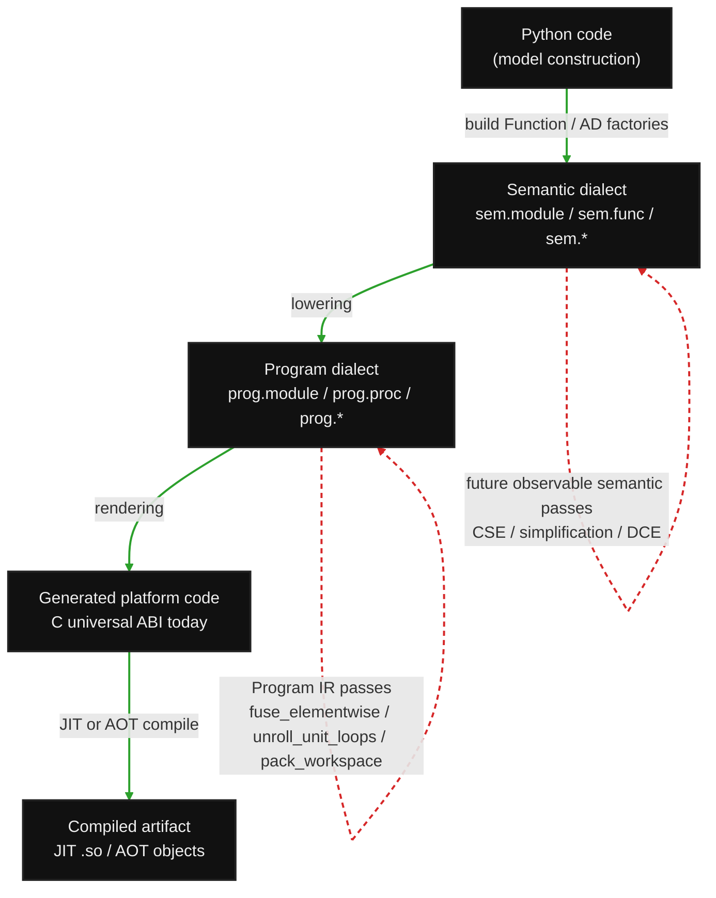

# Alloy experimental IR spec

Alloy is a separate experimental package under `src/alloy`. The name is provisional: it fits the anvil/metal theme and the core idea of mixing SX-like scalar lowering with MX-like block lowering in one graph.

See [`roadmap.md`](roadmap.md) for the planned milestones.

## Goals

- Provide a small CasADi-like symbolic core in pure Python.
- Keep it separate from `anvil` until the design proves itself.
- Treat `Function` as the unit of compilation and composition.
- Support local lowering choices: scalar/SX-like regions and block/MX-like regions in the same graph.
- Preserve a CasADi-style universal C ABI while allowing optional typed buffer wrappers for generated C++.

## Current public API

```python
import alloy as al

x = al.sym("x", 3)
y = (x.sin() + x * x).sum()
f = al.Function("f", [x], [y], ["x"], ["y"])

# Anvil-style scoped construction is the preferred user-facing direction.
@al.function("f_scoped", {"x": 3})
def f_scoped(x):
    return {"y": (x.sin() + x * x).sum()}

assert f([1.0, 2.0, 3.0]).shape == ()
assert f_scoped([1.0, 2.0, 3.0]).shape == ()

# Canonical factory API
g = f.factory("g", ["x"], ["grad:y:x"])
J = f.factory("J", ["x"], ["jac:y:x"])
fwd = f.factory("fwd", ["x", "fwd:x"], ["fwd:y:x"])
adj = f.factory("adj", ["x", "lam:y"], ["adj:y:x"])
spJ = f.factory("spJ", ["x"], ["spjac:y:x"])
spH = f.factory("spH", ["x"], ["sphess:y:x:x"])

# Human-friendly wrappers over the same factory language
g2 = al.gradient(f, "x", "y")
J2 = al.jacobian(f, "x", "y")
fwd2 = al.forward(f, "x", "y")
adj2 = al.adjoint(f, "x", "y")
spJ2 = al.spjacobian(f, "x", "y")
H2 = al.hessian(f, "x", "y")
spH2 = al.sphessian(f, "x", "y")

# Lower-level AD building blocks over Expr graphs
seed = al.sym("seed", y.shape)
(vjp_x,) = al.vjp((y,), (x,), (seed,))
seeds = al.sym("seeds", (4, *x.shape))
fwd_batch = al.jvp_many(y, x, seeds)  # shape (4, *y.shape)
```

## Core compiler concepts

Alloy's current names map to compiler/tinygrad concepts like this:

| Alloy concept | Compiler concept | tinygrad/anvil analogy |
| --- | --- | --- |
| `Ops` | operation opcode enum | tinygrad `Ops` |
| `Expr` | immutable operation node / SSA-ish value | tinygrad `UOp` |
| `Function` | named graph boundary and compilation unit | anvil `NumericalFunction`, CasADi `Function` |
| `Program IR` | lowered executable schedule | tinygrad linearized/scheduled UOps, generated CasADi C |
| `Function.factory()` | derived graph/function builder | CasADi factory strings |
| `lowering` hint | region/codegen policy | future scalar/block partitioning metadata |

`Ops` is a `StrEnum`, so opcodes are proper enum values while still being convenient to serialize and print as strings.

## MVP operation set

The initial supported operation set intentionally covers common modeling and control expressions before specialized numerics:

- Structural: `input`, `const`, `sum`, `reshape`, `vec`, `transpose`, `slice`/indexing, `split`, flat `gather`, `scatter`, `stack`, `concat`, `matmul`, `call`.
- Arithmetic: `add`, `sub`, `mul`, `div`, `pow`, `neg`.
- Reductions/helpers: `dot`, `sumsqr`, `norm_2` lower to existing elementwise, reshape, sum, and sqrt ops.
- Trigonometric: `sin`, `cos`, `tan`, `asin`, `acos`, `atan`, `atan2`.
- Hyperbolic: `sinh`, `cosh`, `tanh`.
- Elementary nonlinearities: `exp`, `log`, `sqrt`, `abs`.
- Nonsmooth/common utilities: `floor`, `ceil`, `minimum`, `maximum` are evaluable but not all have AD rules yet.

`TensorType.diff` is metadata indicating whether an expression depends differentiably on symbolic inputs. Constants and `diff=False` symbols are non-differentiable, structural operations preserve the flag, differentiable arithmetic propagates it from differentiable inputs, and nonsmooth operations such as `floor`, `ceil`, `minimum`, and `maximum` mark outputs as non-differentiable.

Tensor and sparsity shapes must use nonnegative dimensions. If `TensorType.sparsity` is set, its rank-2 shape must match the tensor shape exactly.

Explicitly deferred:

- `expm1`, `log1p`: useful but not essential for the first modeling slice.
- Splines/interpolants: important, but their semantics need a separate design for knots, lookup, extrapolation, derivative behavior, table codegen, and sparsity.
- Matrix decompositions/exponentials and solver control flow.

## Semantic graph inspection, assembly, and opt-in visualization

`Expr.debug()` / `al.format_expr(...)` print the semantic DAG in deterministic topological order with stable `%0`, `%1`, ... names. For compiler-style dumps, `al.render_expr_assembly(fn_or_exprs)` prints the semantic dialect as SSA-like Alloy assembly using the `sem.*` prefix and `al.render_program_assembly(program)` prints structured Program IR assembly using the `prog.*` prefix. Function-level semantic dumps are `sem.module`s that include transitive called function bodies, matching the set of raw callees that eventually appears in generated C. `al.expr_graph(...)` and `al.program_graph(...)` expose the same DAGs as JSON-serializable nodes/edges for tooling.

Executable scheduling lives in Program IR after `lowering.lower_function(...)`; there is no separate tape/interpreter runtime. The canonical pipeline vocabulary is:

- **Artifact formats**: Python code, the **semantic dialect** (`sem.*`), the **program dialect** (`prog.*`), and generated platform-specific code (currently C for the universal ABI).
- **Transformations**: Python construction/building creates semantic-dialect `Function`s; lowering maps the semantic dialect to the program dialect; rendering maps the program dialect to generated code; JIT/AOT compilation consumes generated code.
- **Passes**: internal optimization/simplification steps that operate inside one artifact format. Today the visualizer records Program IR passes (`fuse_elementwise`, `unroll_unit_loops`, `pack_workspace`). Semantic simplification/CSE also happens during AD/sparse-derivative construction, but it is not yet instrumented as an observable pass pipeline once a `Function` has been marked for visualization.



Program IR optimization passes are observable through the opt-in visualizer:

```python
from alloy.viz import visualize, serve

visualize(f)  # exact Function object opt-in; nothing else is recorded
f(x_value)    # JIT render/compile records semantic IR, lowered Program IR, each pass, and generated C
serve(host="127.0.0.1", port=8000)  # use host="0.0.0.0" to broadcast
```

The recording file defaults to `$XDG_CACHE_HOME/alloy/viz/recordings.json` (or `~/.cache/alloy/viz/recordings.json`) and can be moved with `ALLOY_VIZ_DIR` or the server's `--recording-path` option. The visualizer is a tiny Python webserver with a tinygrad-style sidebar/step navigation and no runtime recording unless a function is explicitly marked with `visualize(...)`.

For the tracking-NMPC pass pipeline case that motivated scalar-loop unrolling, the probe script captures the structured equality sparse-Jacobian and prints loop counts at each Program IR step:

```bash
uv run python benchmarks/viz_tracking_eq_jac_probe.py --horizon 10
uv run alloy_viz --recording-path benchmarks/gen/alloy_tracking_eq_jac_viz/recordings.json --browser
```

## Call-node AD

`Function.call(...)` creates first-class `call` expressions and normalizes constant-like arguments to `Expr` nodes before shape checking. JVP currently differentiates through calls by inlining the callee derivative graph and substituting actual call arguments for formal inputs. That construction uses memoized JVP subgraphs and topological cached substitution so repeated named-call structure, such as an RK4 stage function inside a horizon-level equality constraint, does not repeatedly re-walk the same derivative graph. The lower-level `al.vjp(outputs, wrts, cotangents)` reverse pass follows the same initial policy for call nodes. This keeps nested named functions usable for `jac:*`, `grad:*`, and `hess:*` factory outputs while leaving room for future policies that call cached derivative functions instead of inlining.

## Sparsity

Alloy now has explicit `ScalarType` and `SparsityType` vocabulary alongside `TensorType`. `SparsityType` stores a rank-2 structural pattern as COO-style `(rows, cols)` plus shape, with mask conversion helpers.

```python
sp = al.jacobian_sparsity(y, x)
assert sp.shape == (y.size, x.size)
mask = sp.to_mask()
```

`jacobian_sparsity(expr, wrt)` is symbolic and value-independent. It currently covers the structural/arithmetic subset, matmul conservatively, and call nodes via boolean chain rule through the callee. `SparsityType` can convert its COO metadata to and from CSR/CSC pointer/index arrays for solver and codegen interfaces.

`al.sparse_jacobian(y, x)` returns a `SparseJacobian` with the structural pattern and a compact `values` expression containing the Jacobian entries at the nonzero coordinates. The default path first tries a structured decomposition: when `y` is (or is an axis-0 `concat` of) one or more `Ops.MAP` nodes whose outer tensors are exactly `x`, every MAP piece goes through `_sparse_jacobian_map`, which per formal input computes a local sparsity tile on the callee, colors that tile, materializes a constant local-color seed matrix, dispatches through `_call_jvp_many_const_function` (so the per-formal JVP body benefits from seed-constant DCE/CSE), wraps each per-formal JVP in `Ops.MAP` over the original slicing, and assembles the global compact nnz buffer through a constant scatter index table. The fallback (and the path for any non-MAP piece) is `al.sparse_jacobian_colored(y, x)`: it computes `jacobian_sparsity`, greedily colors structurally independent columns of the global pattern, builds one compressed seed vector per color, evaluates JVPs for those colors, simplifies/CSEs each compressed column, and gathers each nonzero from `(row, color[col])`. `SparseJacobian.to_dense()` scatters the compact values back into a dense matrix expression. `al.sparse_jacobian_reference(y, x)` remains available as the dense-Jacobian-then-gather correctness path for small tests. Greedy `column_coloring(...)` and `color_groups(...)` expose the graph-coloring vocabulary.

At the named-function layer, `spjac:out:in` and `sphess:out:in:in` factory requests return compact nonzero values and attach the corresponding pattern in `Function.output_sparsities`. `al.spjacobian(fn, input, output)`, `al.sphessian(fn, input, output)`, and `al.sparse_lagrangian_hessian(...)` are convenience wrappers over those requests.

Generated C headers include sparse output metadata for compact derivative buffers:

```c
#define f_spjac_y_x_NNZ 4
#define f_spjac_y_x_NROW 3
#define f_spjac_y_x_NCOL 4
static const int f_spjac_y_x_rows[4] = {0, 1, 1, 2};
static const int f_spjac_y_x_cols[4] = {0, 2, 3, 1};
static const int f_spjac_y_x_csr_row_ptr[4] = {0, 1, 3, 4};
static const int f_spjac_y_x_csr_col_ind[4] = {0, 2, 3, 1};
static const int f_spjac_y_x_csc_col_ptr[5] = {0, 1, 2, 3, 4};
static const int f_spjac_y_x_csc_row_ind[4] = {0, 2, 1, 1};
```

## Dtype model and device placement (Phase 1)

`DType` is a small interned descriptor with a name, bit-width, C-type spelling, and category flags. The canonical instances live in `dtypes`:

```python
al.dtypes.bool_      # uint8_t, 1 byte
al.dtypes.int32      # int32_t, 4 bytes
al.dtypes.int64      # int64_t, 8 bytes
al.dtypes.float32    # float,   4 bytes
al.dtypes.float64    # double,  8 bytes  (default)
```

For back-compat with prior `dtype="float64"` string usage, `DType.__eq__` accepts strings. Construction APIs (`Expr.sym`, `Expr.const`, `TensorType`, `BufferType`) accept either a `DType` instance or its string name and coerce in `__post_init__`.

Mixed-dtype binary ops are refused without an explicit cast — there is no implicit numeric promotion (`promote_dtype` only verifies that all operands share dtype). This will become more permissive when an explicit `Expr.cast(dtype)` op lands, but the conservative default keeps current `float64` workloads identical and makes future mixed-precision code explicit at the call site.

`DeviceSpec("host" | "cuda" | "opencl" | "metal", index)` is the public placement value:

```python
fn_gpu = fn.with_device("cuda:0")        # placement policy
assert fn_gpu.device == al.DeviceSpec("cuda", 0)
```

Each backend registers a `BackendSupport` capability table (`BACKEND_SUPPORT`). For example `metal` does not currently advertise `float64`, so `Function(..., device="metal:0")` over a `float64` graph fails at construction with a clear diagnostic — not at runtime, and not as a silent host fallback. Today only `host` actually lowers through the JIT; non-host placements raise `JitError("only host lowering is implemented")` when called.

Future phases will extend this:

- Phase 4+ — Program IR carries placement per region so a single host `Function` can contain CPU procedures, GPU kernels, and solver calls.
- Phase 8 — the first GPU backend (CUDA or OpenCL) makes `with_device("cuda:0")` actually lower instead of erroring.

## Mixed lowering

Every expression carries a lowering hint:

- `auto`: let the lowering pass choose.
- `scalar`: prefer SX-like scalar/unrolled code.
- `block`: prefer MX-like block/loop code.
- `opaque`: preserve a named call or future solver/integrator boundary instead of forcing it into symbolic scalar/block lowering.

Example:

```python
sparse_model = (x.sin() + x * x).scalar()
dense_layer = (A @ x).block()
opaque_boundary = dense_layer.opaque()
y = sparse_model + opaque_boundary
```

Today this is metadata preserved on `Expr` nodes and visible via semantic graph inspection. Later it should drive partitioning: scalar regions lower to explicit scalar instructions, dense regions lower to block kernels/loops, and the boundary inserts materialization/copy/project operations.

## Program IR (Phase 4)

`src/alloy/program.py` introduces the lower IR where explicit loops, buffers, loads/stores, calls, kernel launches, and memory spaces live. Phase 4 ships the vocabulary, the verifier, and the pretty-printer; the lowering pass that produces Program IR from semantic IR is Phase 5.

A single `PNode` class (frozen, hash-consed) carries an op tag from `POps`. Statement vs declaration vs scalar-expression is encoded by op tag, matching the tinygrad UOp style and reusing the spec-table verifier infrastructure from Phase 2:

```python
from alloy import program as p
from alloy.types import dtypes
from alloy.program import RangeKind, verify_program, format_program, spec_program_full

in_buf = p.buffer("in_", dtypes.float64, (16,))
out_buf = p.buffer("out_", dtypes.float64, (16,))
i = p.var("i", dtype=dtypes.int64)
k = p.kernel(
    "k_neg",
    [in_buf, out_buf],
    [
        p.for_(
            p.range_("i", 0, 16, kind=RangeKind.GLOBAL),
            [p.store(p.view(out_buf, [i]), p.neg(p.load(p.view(in_buf, [i]))))],
        ),
    ],
    grid_dims=1,
    device="cuda:0",
)
verify_program(k)
print(format_program(k))
```

`RangeKind` borrows tinygrad's `AxisType` vocabulary (`SERIAL`, `VECTOR`, `GLOBAL`, `THREAD`, `LOCAL`, `WARP`, `REDUCE`, `GROUP_REDUCE`, `UNROLL`). Backends use it to bind loops to launch axes, choose vectorized vs unrolled emission, or lower reductions. Buffer address spaces follow the OpenCL/CUDA naming (`global`/`local`/`private`/`constant`).

Verifier specs:

- `spec_program_shared` — invariants every Program IR node must satisfy (buffer attrs, view scalar args, load/store shapes, range kind enum, etc.).
- `spec_host_program` — host PROCs may not contain device-only ops (e.g. `BARRIER`).
- `spec_kernel_program` — KERNELs may not contain host-only ops (e.g. `LAUNCH`).
- `spec_program_full` — both, suitable for whole-program checks.

Pretty-printing is backend-neutral and decoupled from C syntax — it shows host/device boundaries, range kinds, and launch specs so schedule decisions are debuggable before any renderer runs.

## Semantic IR verifier (Phase 2)

Each IR level should have an explicit spec table and verifier (see roadmap Phase 2). The semantic IR layer ships its spec in `src/alloy/spec.py`:

```python
import alloy as al

x = al.sym("x", 3)
y = (x.sin() + x * x).sum()
al.verify_expr(y)                       # silent on success
al.verify_expr(y, spec=al.spec_semantic)  # explicit spec choice
```

The verifier walks the DAG topologically and raises `VerifyError` at the first invalid node, naming the node, its op, and the failing rule. Two specs are exported today:

- `spec_semantic_shared` — rules every node must satisfy (non-negative shape, `DType`-typed dtype, arity matches `OP_INFO`, sparsity shape agrees with tensor shape).
- `spec_semantic` — `spec_semantic_shared` plus per-op rules (e.g. `RESHAPE` size, `TRANSPOSE` axes are a permutation, `MATMUL` contracting dims, `CALL` arg shapes match the callee, `MAP` outers are rank-1 with consistent `slice_size`, `CONST` value shape/dtype match the declared type).

Verification is opt-in: construction-time checks in `expr.py` keep the happy path fast. `verify_expr` is the explicit defensive check passes should run after non-trivial graph rewrites or AD transforms, and the harness for negative tests in `tests/alloy/test_verifier.py`.

## Structural equality and rewrites

`Expr.id` remains a construction-time identity, while `Expr.structural_key()`, `Expr.structural_hash()`, and `Expr.structurally_equal()` compare graph structure. This lets compiler passes identify equivalent subgraphs without changing user-visible node identity. `Expr.debug()` / `al.format_expr(...)` print stable topological `%0`, `%1`, ... names for small graph inspection.

Alloy also has a small graph rewrite layer:

```python
y_cse = al.cse(y)
y_clean = al.simplify(y_cse)
```

The first pass supports CSE, constant folding, and simple algebraic identities such as `x + 0`, `x * 1`, `x * 0`, and identity reshape/transpose. Rewrites use an op-indexed `PatternMatcher` and topological replacement cache so DAG sharing is preserved better than a recursive tree walk. This is still intentionally much smaller than tinygrad's `UPat`/`PatternMatcher`, but it establishes the compiler path for AD cleanup and canonicalization.

## Execution: JIT/AOT through Program IR

`Function.__call__` lazily renders the function to C through Program IR, compiles it through `cc`, caches the resulting shared object on disk and in-process, and dispatches through the universal ABI via `ctypes` (see `src/alloy/jit.py`). Subsequent calls reuse the cached `.so`. Multiple `Function` instances with identical generated source share the same artifact via a SHA-256 key over (`_JIT_CACHE_VERSION`, ABI signature, function name, rendered C source).

There is no Python interpreter fallback: Python calls, tests, and AOT generation all exercise the same semantic-IR → Program-IR → renderer path. Codegen/lowering gaps and missing compilers fail loudly.

Environment variables that influence JIT behavior:

- ``ALLOY_CACHE_DIR`` — override the on-disk cache root (default ``$XDG_CACHE_HOME/alloy/jit`` or ``~/.cache/alloy/jit``).
- ``ALLOY_CC`` — override the C compiler binary (default ``cc`` from ``$PATH``; works on Linux/macOS/BSD where ``cc`` is the POSIX symlink to the system's default C compiler).

`Function.recompile()` drops both the in-process compiled handle and the on-disk cache directory for the next call.

Workspace packing is a Program IR pass (`passes.pack_workspace`): small temporaries stay as local C arrays and large ones spill to the caller-provided `w[]`, so `f_SZ_W` is the packed spill size.

## Benchmark workload fixtures

The first benchmark-shaped Alloy fixture is the tracking NMPC equality constraint Jacobian in `tests/alloy/test_tracking_workload.py`. It defines scoped stage functions for initial-state pinning and RK4 interstage dynamics, composes them into a horizon-level named function through `Function.call(...)`, and checks small-horizon dense Jacobians against CasADi. It also checks that colored compact sparse-Jacobian metadata and values agree with the dense-gather reference path. An explicit opt-in sweep runs with `ALLOY_TRACKING_SWEEP=1 uv run pytest tests/alloy/test_tracking_workload.py -q -s`; it covers horizons `N=1,2,5,10`, records expression node counts, sparsity nnz, coloring count, AD construction time, and generated C source size, and compares compact values against CasADi. For native timing without Python/`ctypes` overhead, `uv run python benchmarks/alloy_tracking_eq_jac_benchmark.py --horizons 1 2 5 10 -- --benchmark_min_time=0.01s` generates Alloy, CasADi SX, and CasADi MX C, compiles one Google Benchmark C++ binary per horizon, and reports runtime plus generated source sizes. The current tracking baseline preserves named stage derivative calls and batched color seeds, giving much smaller horizon growth than flat scalarization; after local temporaries, slice-aliasing, and constant-seed specialization, one `N=50` run produced Alloy at 364 KB / 13112 lines / 0 workspace / 5.1 us, CasADi SX at 466 KB / 25902 lines / 77 workspace doubles / 4.6 us, and CasADi MX at 2.0 MB / 63134 lines / 8046 workspace doubles / 8.4 us.

A second benchmark-shaped fixture is the official-size unbumpercars inequality Jacobian in `tests/alloy/test_unbumpercars_workload.py`. It uses the same MLP layer sizes as the example model (`256 -> 128 -> 3`) and loads the official `model_kinematic_mlp.pth` weights into the parameter vector, while keeping the normal unit test at `N=2`. Dense MLP matmuls are marked with `block` lowering metadata and sparse C3BF/wall/slack assembly with `scalar` metadata. Tests compare dense and colored sparse Alloy Jacobians against CasADi MX for `N=2`, including sparsity structure. `uv run python benchmarks/alloy_unbumpercars_ineq_jac_benchmark.py --stats-only --car-counts 2` prints source/workspace stats for Alloy, CasADi SX, and CasADi MX; `--backend alloy --backend casadi-mx` runs the native Google Benchmark without trying to compile the huge SX source. After stack-through-slice and slice-of-slice rewrites and scalar/vector inlining through elementwise/stack/concat consumers, a local `N=2` stats run produced Alloy at 38 KB / 1235 lines / 0 workspace, CasADi SX at 12.2 MB / 447759 lines / 36274 workspace doubles, and CasADi MX at 217 KB / 6689 lines / 141500 workspace doubles; the Alloy-vs-MX native run was ~94 us vs ~252 us. The SX source is correctly enormous for the dense MLP case and was not compiled in the quick benchmark loop.

Both benchmark harnesses also run a fail-fast correctness check before invoking Google Benchmark: each backend's compact Jacobian is scattered into a dense matrix using its own `(rows, cols)` sparsity, and compared to a Python alloy reference dense Jacobian written next to the generated sources. The check catches NaN-vs-finite mismatches and exits non-zero with a per-element diff. The compact-vs-compact diff that this replaces was wrong because Alloy uses COO row-major nnz order while CasADi uses CSC column-major.

Workspace packing is a Program IR pass (`passes.pack_workspace`), not a tape-renderer step: it lifetime-packs the `private` BUFFERs of each PROC into shared slots (buffers whose lifetimes don't overlap reuse the same slot), then spills slots ≥ 1024 doubles to the caller's `w[]` while small ones stay as local `double` arrays. Zero-copy alias BUFFERs (RESHAPE, contiguous SLICE pointer aliases) own no storage but extend the lifetime of the buffer they point into, so a reused slot is never overwritten while a downstream consumer can still observe it. Elementwise/slice/gather chains are collapsed earlier by `passes.fuse_elementwise`, so they never reach the packer as separate buffers. The combination keeps the official-size unbumpercars per-JVP frame bounded and lets the largest sweep cells spill to a `static` `w[]` instead of overflowing the C stack.

The contiguous-slice pointer-alias path (`lowering._contiguous_slice_offset`) once had a correctness bug in its legacy form: it mis-detected column-style slices like `(slice(None), 1)` on a `(5, 7)` tensor as contiguous and aliased flat indices `[1, 2, 3, 4, 5]` instead of the column `[1, 8, 15, 22, 29]`. The rule now rejects int indices that appear after a slice unless the indexed dim has size 1, with a compile-and-verify regression test in `tests/alloy/test_core.py`.

## Scalability sweep

The full per-cell sweep across tracking horizons `N ∈ {1, 5, 10, 25, 50, 100, 200, 500, 1000}` and unbumpercars car counts `C ∈ {2, 4, 8, 16, 32}` is in `benchmarks/scalability_sweep.py`. It compiles one Google Benchmark binary per `(workload, size, backend)` cell with a configurable per-compile timeout (default 180 s) and a max-source-size cap (default 50 MB). Backends that hit a timeout or size cap at one cell are short-circuited to `skipped_after_failure` at all larger cells of the same workload. CSV output lives at `benchmarks/scalability_results.csv` and is summarized in [`scalability.md`](scalability.md). The short version: Alloy is within ~10 % of CasADi SX runtime and **smaller in C source** than SX past `N=10` on tracking, and beats CasADi MX by ~2.7× on the official-size unbumpercars workload; the remaining open work is constant-source loop preservation rather than per-stage performance.

## ABI

The baseline ABI is CasADi-compatible in spirit:

```c
int f(const double** arg, double** res, int* iw, double* w, void* mem);
```

This makes nested calls, generated solvers, and possible acados-style consumers easier. Alloy also supports optional typed buffer wrappers in generated headers, e.g. fixed-size structs for statically known shapes. The universal ABI stays the lowest common denominator; typed buffers are sugar for safer C++ integration.

The caller owns all ABI storage:

- `arg` is an array of `f_SZ_ARG` input pointers. Each non-null `arg[i]` points to a contiguous row-major `double` buffer with the statically known flattened input size.
- `res` is an array of `f_SZ_RES` output pointers. Each non-null `res[i]` points to caller-owned contiguous row-major `double` storage with the statically known flattened output size.
- `w` points to at least `f_SZ_W` doubles when `f_SZ_W > 0`; it may be null only when `f_SZ_W == 0`.
- `iw` is currently unused because `f_SZ_IW == 0`; callers may pass null.
- `mem` is currently unused by pure symbolic functions; callers may pass null after using the stateless memory hooks.
- Inputs do not have default values today: every required `arg[i]` must be non-null.
- Generated code assumes ordinary C `double`/`int` alignment for the buffers supplied by the caller.

Generated headers declare `f_sz_arg`, `f_sz_res`, `f_sz_iw`, and `f_sz_w` helpers, plus compile-time `f_SZ_*` constants for generated callers. The source renderer lowers the function to Program IR and emits standalone C for it, returning nonzero error codes for missing ABI pointer slots. Small temporaries stay as C locals and large ones spill to the caller's `w[]`, so `f_SZ_W` is the packed spill size (often `0` for small functions). When a rendered function has callees, `render_c_source` emits internal `static inline` raw callee bodies before the exported ABI wrapper and invokes them directly; only the root is exported through the universal ABI in that translation unit. A `SolverFunction` callee is the one exception — it is rendered by the hand-written `codegen/solver_c` wrapper template that drives its (Program-IR-rendered) oracle Functions.

When typed buffers are enabled, generated headers also include a small C++ inline wrapper such as `f_call(const f_x_in& in_x, f_y_out& out_y)`. The wrapper builds the universal `arg`/`res` pointer arrays, allocates fixed-size stack workspace from `f_SZ_W`, and calls the canonical ABI. Generated C++ headers also emit `static_assert` checks that each typed buffer struct has the expected flattened `double` size. This is intentionally sugar; the pointer ABI remains the stable interface.

`render_c_module(fn)` packages the generated artifacts as a `CModule(header_name, source_name, header, source)`. The module source includes the generated header first, so it can be compiled as a C translation unit and linked into C++ callers that include the same header.

Generated modules expose stateless memory hooks today:

```c
void* f_alloc_mem(void);
int f_init_mem(void* mem);
void f_free_mem(void* mem);
```

For current symbolic functions `f_alloc_mem()` returns `NULL`, `f_init_mem(mem)` ignores `mem` and returns `ALLOY_SUCCESS`, and `f_free_mem(mem)` is a no-op. The hook shape leaves room for future solver/integrator memory without changing the exported ABI.

Generated functions return named ABI status codes:

| Code | Meaning |
| --- | --- |
| `ALLOY_SUCCESS = 0` | Evaluation succeeded. |
| `ALLOY_ERR_NULL_ABI = 1` | The top-level `arg` or `res` pointer array is null. |
| `ALLOY_ERR_NULL_WORK = 2` | The function needs floating workspace but `w` is null. |
| `ALLOY_ERR_NULL_RESULT = 3` | One required `res[i]` output buffer is null. |
| `ALLOY_ERR_NULL_INPUT = 4` | One required `arg[i]` input buffer is null. |

## QP and NLP solvers

`al.qp(...)` and `al.nlp(...)` build opaque `SolverFunction`s wrapping PIQP
(dense QP) and IPOPT (sparse-Jacobian, sparse-Lagrangian-Hessian NLP). The
data exprs may be Alloy `Expr`s of free parameters; oracle derivatives come
through `Function.factory(...)` (`grad`, `spjac`, `sphess` with a Lagrangian
`aux={"gamma": [...]}`). Each solver is a real `Function` whose body is
``Ops.SOLVER_CALL`` (one per output, all sharing a ``SolverDescriptor``
side-table). That means ``solver.call([...])`` returns ``Expr``s, so solvers
nest directly inside larger ``@al.function``-decorated graphs (the
safety-filter assembly pattern). ``SOLVER_CALL`` is marked non-differentiable.

C codegen for a solver-bearing graph is wired and JIT-compiles end-to-end:
`codegen/solver_c` renders the `SolverFunction` wrapper (the one hand-written,
non-Program-IR template — it drives the vendored PIQP/IPOPT C interfaces),
while every other Function in the graph — the oracle data/derivative Functions
*and* the host Function that calls the solver — lowers through Program IR. The
lowerer treats a `SolverFunction` callee as opaque (it does not lower the
`SOLVER_CALL` body) but still lowers its oracle Functions to PROCs, and
`render_c_source` orchestrates the single translation unit (oracle `_raw`
bodies, then the solver wrapper, then the host ABI entry). `solver_compile_flags`
adds the `-lpiqpc` / `-lipopt` link flags. The bound shared libraries live under
`src/alloy/lib/`. Full interface, sign conventions, and current limitations are
documented in [`solvers.md`](solvers.md).
